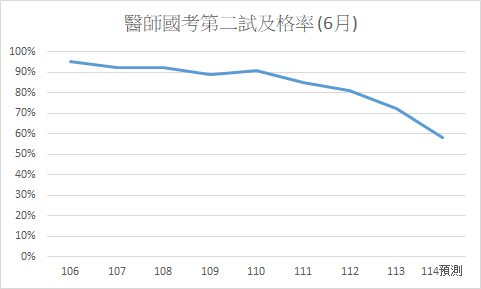
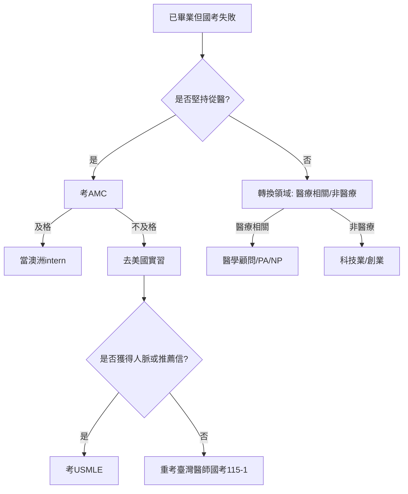

# 114年第二次專門職業及技術人員高等考試醫師中醫師考試分階段考試(第二階段考試) 考前猜題
**按照真實考試題數分配！題號與考古題相同！**<br>
**1小時加強弱科考試重點！**

「猜題來源: 臨床」意指以實習經驗(含門診及住院)及上課內容為主以考古題及114-2新考綱為輔之猜題<br>
「猜題來源: 考古題」意指以考古題及114-2新考綱為主以實習經驗(含門診及住院)及上課內容為輔之猜題<br>
陽明醫學系共筆建議讀「重點整理」<br>
UpToDate建議讀「SUMMARY AND RECOMMENDATIONS」
## 醫學(三)
### 　 內科
#### 　　一般內科 (猜題來源: 臨床)
1. Stress ulcers in the intensive care unit: Diagnosis, management, and prevention ([UpToDate](https://www.uptodate.com/contents/stress-ulcers-in-the-intensive-care-unit-diagnosis-management-and-prevention))
2. Pulmonary artery catheterization: Indications, contraindications, and complications in adults ([UpToDate](https://www.uptodate.com/contents/pulmonary-artery-catheterization-indications-contraindications-and-complications-in-adults))
3. Sepsis syndromes in adults: Epidemiology, definitions, clinical presentation, diagnosis, and prognosis ([UpToDate](https://www.uptodate.com/contents/sepsis-syndromes-in-adults-epidemiology-definitions-clinical-presentation-diagnosis-and-prognosis))
4. Maintenance and replacement fluid therapy in adults ([UpToDate](https://www.uptodate.com/contents/maintenance-and-replacement-fluid-therapy-in-adults))
5. Use of vasopressors and inotropes ([UpToDate](https://www.uptodate.com/contents/use-of-vasopressors-and-inotropes))
#### 心臟內科 (猜題來源: 考古題)
##### 缺血性心臟病
6. Atherosclerotic cardiovascular disease risk assessment for primary prevention in adults ([UpToDate](https://www.uptodate.com/contents/atherosclerotic-cardiovascular-disease-risk-assessment-for-primary-prevention-in-adults))
7. Overview of the acute management of non-ST-elevation acute coronary syndromes ([UpToDate](https://www.uptodate.com/contents/overview-of-the-acute-management-of-non-st-elevation-acute-coronary-syndromes))
##### 心肌症
8. Major causes of dilated cardiomyopathy ([UpToDate](https://www.uptodate.com/contents/image?imageKey=CARD/60494&topicKey=CARD%2F3516&search=dilated+cardiomyopathy&source=outline_link&selectedTitle=1%7E150))
##### 心電圖
9. Overview of cardiac arrhythmias ([Amboss](https://next.amboss.com/us/article/7S04af))
##### 高血壓
10. Overview of hypertension in adults ([UpToDate](https://www.uptodate.com/contents/overview-of-hypertension-in-adults))
##### 血管病
11. Aneurysm ([Amboss](https://next.amboss.com/us/article/Wh0P1f))
##### 心包疾病
12. Acute pericarditis: Clinical presentation and diagnosis ([UpToDate](https://www.uptodate.com/contents/acute-pericarditis-clinical-presentation-and-diagnosis))
##### 心衰竭
13. Clinical manifestations and diagnosis of advanced heart failure ([UpToDate](https://www.uptodate.com/contents/clinical-manifestations-and-diagnosis-of-advanced-heart-failure))
##### 心律不整
14. Atrial fibrillation: Overview and management of new-onset atrial fibrillation ([UpToDate](https://www.uptodate.com/contents/atrial-fibrillation-overview-and-management-of-new-onset-atrial-fibrillation))
#### 胃腸科 (猜題來源: 臨床)
15. Hepatitis B virus: Overview of management ([UpToDate](https://www.uptodate.com/contents/hepatitis-b-virus-overview-of-management))
16. Diagnostic approach to the adult with jaundice or asymptomatic hyperbilirubinemia ([UpToDate](https://www.uptodate.com/contents/diagnostic-approach-to-the-adult-with-jaundice-or-asymptomatic-hyperbilirubinemia))
17. Treatment of irritable bowel syndrome in adults ([UpToDate](https://www.uptodate.com/contents/treatment-of-irritable-bowel-syndrome-in-adults))
18. Spontaneous bacterial peritonitis in adults: Treatment and prophylaxis ([UpToDate](https://www.uptodate.com/contents/spontaneous-bacterial-peritonitis-in-adults-treatment-and-prophylaxis))
19. Clinical manifestations, diagnosis, and staging of esophageal cancer ([UpToDate](https://www.uptodate.com/contents/clinical-manifestations-diagnosis-and-staging-of-esophageal-cancer))
20. Overview of the management of patients with variceal bleeding ([UpToDate](https://www.uptodate.com/contents/overview-of-the-management-of-patients-with-variceal-bleeding))
21. Clinical manifestations, diagnosis, and staging of exocrine pancreatic cancer ([UpToDate](https://www.uptodate.com/contents/clinical-manifestations-diagnosis-and-staging-of-exocrine-pancreatic-cancer))
22. Overview of treatment approaches for hepatocellular carcinoma ([UpToDate](https://www.uptodate.com/contents/overview-of-treatment-approaches-for-hepatocellular-carcinoma))
23. Cirrhosis in adults: Etiologies, clinical manifestations, and diagnosis ([UpToDate](https://www.uptodate.com/contents/cirrhosis-in-adults-etiologies-clinical-manifestations-and-diagnosis))
#### 腎臟科 (猜題來源: 臨床)
24. Overview of the management of acute kidney injury (AKI) in adults ([UpToDate](https://www.uptodate.com/contents/overview-of-the-management-of-acute-kidney-injury-aki-in-adults))
25. Overview of heavy proteinuria and the nephrotic syndrome ([UpToDate](https://www.uptodate.com/contents/overview-of-heavy-proteinuria-and-the-nephrotic-syndrome))
26. Overview of the management of chronic kidney disease in adults ([UpToDate](https://www.uptodate.com/contents/overview-of-the-management-of-chronic-kidney-disease-in-adults))
27. Dialysis modality and patient outcome ([UpToDate](https://www.uptodate.com/contents/dialysis-modality-and-patient-outcome))
28. Approach to the adult with metabolic acidosis ([UpToDate](https://www.uptodate.com/contents/approach-to-the-adult-with-metabolic-acidosis))
29. Diagnostic evaluation of adults with hyponatremia ([UpToDate](https://www.uptodate.com/contents/diagnostic-evaluation-of-adults-with-hyponatremia))
30. Kidney stones in adults: Prevention of recurrent kidney stones ([UpToDate](https://www.uptodate.com/contents/kidney-stones-in-adults-prevention-of-recurrent-kidney-stones))
#### 過敏免疫風濕科 (猜題來源: 臨床)
##### 結締組織病
31. Systemic lupus erythematosus in adults: Clinical manifestations and diagnosis ([UpToDate](https://www.uptodate.com/contents/systemic-lupus-erythematosus-in-adults-clinical-manifestations-and-diagnosis))
32. Clinical manifestations and diagnosis of systemic sclerosis (scleroderma) in adults ([UpToDate](https://www.uptodate.com/contents/clinical-manifestations-and-diagnosis-of-systemic-sclerosis-scleroderma-in-adults))
33. Overview of the management and prognosis of Sjögren's disease ([UpToDate](https://www.uptodate.com/contents/overview-of-the-management-and-prognosis-of-sjogrens-disease))
##### 關節炎
34. Diagnosis and differential diagnosis of rheumatoid arthritis ([UpToDate](https://www.uptodate.com/contents/diagnosis-and-differential-diagnosis-of-rheumatoid-arthritis))
35. Overview of the clinical manifestations and classification of spondyloarthritis ([UpToDate](https://www.uptodate.com/contents/overview-of-the-clinical-manifestations-and-classification-of-spondyloarthritis))
#### 腫瘤科 (猜題來源: 臨床)
36. Overview of the classification and management of cancers of unknown primary site ([UpToDate](https://www.uptodate.com/contents/overview-of-the-classification-and-management-of-cancers-of-unknown-primary-site))
37. Overview of the treatment of newly diagnosed, invasive, non-metastatic breast cancer ([UpToDate](https://www.uptodate.com/contents/overview-of-the-treatment-of-newly-diagnosed-invasive-non-metastatic-breast-cancer))
38. Overview of the initial treatment and prognosis of lung cancer ([UpToDate](https://www.uptodate.com/contents/overview-of-the-initial-treatment-and-prognosis-of-lung-cancer))
39. Overview of the management of primary colon cancer ([UpToDate](https://www.uptodate.com/contents/overview-of-the-management-of-primary-colon-cancer))
40. Clinical presentation, diagnosis, and staging of gastric cancer ([UpToDate](https://www.uptodate.com/contents/clinical-presentation-diagnosis-and-staging-of-gastric-cancer))
41. Clinical manifestations, diagnosis, and staging of exocrine pancreatic cancer ([UpToDate](https://www.uptodate.com/contents/clinical-manifestations-diagnosis-and-staging-of-exocrine-pancreatic-cancer))
#### 血液科 (猜題來源: 臨床)
##### Platelet
42. Hemostasis and bleeding disorders ([Amboss](https://next.amboss.com/us/article/8T0Os2))
##### RBC
43. Microcytosis/Microcytic anemia ([UpToDate](https://www.uptodate.com/contents/microcytosis-microcytic-anemia))
##### WBC
44. Acute leukemia ([Amboss](https://next.amboss.com/us/article/iT0Jq2))
#### 胸腔內科 (猜題來源: 臨床)
45. Overview of community-acquired pneumonia in adults ([UpToDate](https://www.uptodate.com/contents/overview-of-community-acquired-pneumonia-in-adults))
46. The evaluation, diagnosis, and treatment of the adult patient with acute hypercapnic respiratory failure ([UpToDate](https://www.uptodate.com/contents/the-evaluation-diagnosis-and-treatment-of-the-adult-patient-with-acute-hypercapnic-respiratory-failure))
47. Acute respiratory distress syndrome: Clinical features, diagnosis, and complications in adults ([UpToDate](https://www.uptodate.com/contents/acute-respiratory-distress-syndrome-clinical-features-diagnosis-and-complications-in-adults))
48. Pleural fluid analysis in adults with a pleural effusion ([UpToDate](https://www.uptodate.com/contents/pleural-fluid-analysis-in-adults-with-a-pleural-effusion))
49. Treatment of primary spontaneous pneumothorax in adults ([UpToDate](https://www.uptodate.com/contents/treatment-of-primary-spontaneous-pneumothorax-in-adults))
50. Chronic obstructive pulmonary disease: Diagnosis and staging ([UpToDate](https://www.uptodate.com/contents/chronic-obstructive-pulmonary-disease-diagnosis-and-staging))
51. An overview of asthma management in children and adults ([UpToDate](https://www.uptodate.com/contents/an-overview-of-asthma-management-in-children-and-adults))
#### 新陳代謝科 (猜題來源: 臨床)
##### Diabetes
52. Clinical presentation, diagnosis, and initial evaluation of diabetes mellitus in adults ([UpToDate](https://www.uptodate.com/contents/clinical-presentation-diagnosis-and-initial-evaluation-of-diabetes-mellitus-in-adults))
53. Metabolic syndrome (insulin resistance syndrome or syndrome X) ([UpToDate](https://www.uptodate.com/contents/metabolic-syndrome-insulin-resistance-syndrome-or-syndrome-x))
54. Obesity in adults: Overview of management ([UpToDate](https://www.uptodate.com/contents/obesity-in-adults-overview-of-management))
##### Dyslipidemia
55. Low-density lipoprotein cholesterol-lowering therapy in the primary prevention of cardiovascular disease ([UpToDate](https://www.uptodate.com/contents/low-density-lipoprotein-cholesterol-lowering-therapy-in-the-primary-prevention-of-cardiovascular-disease))
##### Endocrine
56. Laboratory assessment of thyroid function ([UpToDate](https://www.uptodate.com/contents/laboratory-assessment-of-thyroid-function?search=thyroid))
57. Treatment of hypocalcemia ([UpToDate](https://www.uptodate.com/contents/treatment-of-hypocalcemia))
58. Causes of primary adrenal insufficiency (Addison disease) ([UpToDate](https://www.uptodate.com/contents/causes-of-primary-adrenal-insufficiency-addison-disease))
#### 感染科 (猜題來源: 臨床)
59. Acute and early HIV infection: Clinical manifestations and diagnosis ([UpToDate](https://www.uptodate.com/contents/acute-and-early-hiv-infection-clinical-manifestations-and-diagnosis))
60. Tuberculosis infection (latent tuberculosis) in adults: Approach to diagnosis (screening) ([UpToDate](https://www.uptodate.com/contents/tuberculosis-infection-latent-tuberculosis-in-adults-approach-to-diagnosis-screening))
61. Infection prevention: Precautions for preventing transmission of infection ([UpToDate](https://www.uptodate.com/contents/infection-prevention-precautions-for-preventing-transmission-of-infection))
62. Beta-lactam antibiotics: Mechanisms of action and resistance and adverse effects ([UpToDate](https://www.uptodate.com/contents/beta-lactam-antibiotics-mechanisms-of-action-and-resistance-and-adverse-effects))
63. Overview of community-acquired pneumonia in adults ([UpToDate](https://www.uptodate.com/contents/overview-of-community-acquired-pneumonia-in-adults))
64. Screening for sexually transmitted infections ([UpToDate](https://www.uptodate.com/contents/screening-for-sexually-transmitted-infections))
65. 病毒學國考總複習 ([陽明醫學系黃麗華老師](內部/陽明醫學系112級上課講義/2019%20病毒學國考複習給醫二.pdf))
### 家庭醫學科 (猜題來源: 臨床)
#### 家庭醫業
66. 家庭醫學的照顧特色：3C2A ([內部](內部/3C2A.md))
67. Obesity in adults: Overview of management ([UpToDate](https://www.uptodate.com/contents/obesity-in-adults-overview-of-management))
#### 預防醫學
68. 嬰幼兒預防接種時程海報 ([衛福部疾管署](https://www.cdc.gov.tw/File/Get?q=alK1SUhIV6SOP0j4uU3aI7aYD5CNmxXJXAgbcPCy5Mj5d0TnNiVZy5aDEBVIlSO5kZ5pqAGpOQ5FCdQNl36pYTqGkKJSBG2iwtQWOlb2AxTU1U8YzzGWTk5x42GrqevBKYo-tRf_00xVLuwnra5t3g)(下載jpg檔))
69. A and B Recommendations ([USPSTF](https://www.uspreventiveservicestaskforce.org/uspstf/recommendation-topics/uspstf-a-and-b-recommendations) [USPSTF](https://www.uspreventiveservicestaskforce.org/webview))
#### 行為醫學
70. Glossary of common biostatistical and epidemiological terms ([UpToDate](https://www.uptodate.com/contents/glossary-of-common-biostatistical-and-epidemiological-terms))
71. Depression in adults: Clinical features and diagnosis ([UpToDate](https://www.uptodate.com/contents/depression-in-adults-clinical-features-and-diagnosis))
#### 社區醫學
72. Metabolic syndrome (insulin resistance syndrome or syndrome X) ([UpToDate](https://www.uptodate.com/contents/metabolic-syndrome-insulin-resistance-syndrome-or-syndrome-x))
#### 緩和醫學
73. 安寧緩和醫療條例 ([全國法規資料庫](https://law.moj.gov.tw/LawClass/LawAll.aspx?pcode=L0020066))
### 放射科 (猜題來源: 臨床)
#### 腹部影像醫學
74. Hepatic hemangioma ([Radiopaedia](https://radiopaedia.org/articles/hepatic-haemangioma))
75. Hepatocellular carcinoma ([Radiopaedia](https://radiopaedia.org/articles/hepatocellular-carcinoma))
### 急診醫學科 (猜題來源: 臨床)
#### 急診內科
76. Adult Cardiac Arrest Algorithm ([AHA](https://cpr.heart.org/-/media/CPR-Images/CPR-Guidelines-Images/Part-3-Adult-Basic-and-Advanced-Life-Support/AlgorithmACLS_CA_200731.jpg)(jpg檔))
77. Adult Bradycardia Algorithm ([AHA](https://cpr.heart.org/-/media/CPR-Images/CPR-Guidelines-Images/Part-3-Adult-Basic-and-Advanced-Life-Support/Adult_Bradycardia_Algorithm.jpg)(jpg檔))
78. Acute Coronary Syndrome Algorithm ([外部](https://acls-algorithms.com/wp-content/uploads/2022/06/Website-ACS-Algorithm-Diagram.pdf)(pdf檔))
### 醫學倫理
79. a
80. 


## 醫學(四)
### 　 小兒科 (猜題來源: 考古題)
#### 　　一般兒科
1. Overview of enteral nutrition in infants and children ([UpToDate](https://www.uptodate.com/contents/overview-of-enteral-nutrition-in-infants-and-children))
2. Normal growth patterns in infants and prepubertal children ([UpToDate](https://www.uptodate.com/contents/normal-growth-patterns-in-infants-and-prepubertal-children))
#### 新生兒科
3. Overview of TORCH infections ([UpToDate](https://www.uptodate.com/contents/overview-of-torch-infections))
4. Respiratory distress syndrome (RDS) in preterm neonates: Clinical features and diagnosis ([UpToDate](https://www.uptodate.com/contents/respiratory-distress-syndrome-rds-in-preterm-neonates-clinical-features-and-diagnosis))
5. Assessment of the newborn infant ([UpToDate](https://www.uptodate.com/contents/assessment-of-the-newborn-infant))
#### 心臟科
6. Cyanotic congenital heart disease (CHD) in the newborn: Causes, evaluation, and initial management ([UpToDate](https://www.uptodate.com/contents/cyanotic-congenital-heart-disease-chd-in-the-newborn-causes-evaluation-and-initial-management))
7. Acyanotic congenital heart defects ([Amboss](https://next.amboss.com/us/article/4403jT))
8. Infective endocarditis in children ([UpToDate](https://www.uptodate.com/contents/infective-endocarditis-in-children))
#### 小兒消化科
9. Chronic abdominal pain in children and adolescents: Approach to the evaluation ([UpToDate](https://www.uptodate.com/contents/chronic-abdominal-pain-in-children-and-adolescents-approach-to-the-evaluation))
10. Diagnostic approach to diarrhea in children in resource-abundant settings ([UpToDate](https://www.uptodate.com/contents/diagnostic-approach-to-diarrhea-in-children-in-resource-abundant-settings))
11. Congenital anomalies of the intrathoracic airways and tracheoesophageal fistula ([UpToDate](https://www.uptodate.com/contents/congenital-anomalies-of-the-intrathoracic-airways-and-tracheoesophageal-fistula))
#### 腎臟科
12. Urinary tract infections in children and adolescents ([Amboss](https://next.amboss.com/us/article/oG00Z3))
13. Overview of the pathogenesis and causes of glomerulonephritis in children ([UpToDate](https://www.uptodate.com/contents/overview-of-the-pathogenesis-and-causes-of-glomerulonephritis-in-children))
14. Overview of heavy proteinuria and the nephrotic syndrome ([UpToDate](https://www.uptodate.com/contents/overview-of-heavy-proteinuria-and-the-nephrotic-syndrome))
#### 兒童過敏氣喘及免疫風濕科
15. An overview of asthma management in children and adults ([UpToDate](https://www.uptodate.com/contents/an-overview-of-asthma-management-in-children-and-adults))
16. Congenital immunodeficiency disorders ([Amboss](https://next.amboss.com/us/article/tM0Xqg))
17. Juvenile idiopathic arthritis ([Amboss](https://next.amboss.com/us/article/w40hlT))
#### 血液腫瘤科
##### 腫瘤科
18. Overview of the clinical presentation and diagnosis of acute lymphoblastic leukemia/lymphoma in children ([UpToDate](https://www.uptodate.com/contents/overview-of-the-clinical-presentation-and-diagnosis-of-acute-lymphoblastic-leukemia-lymphoma-in-children))
19. Acute myeloid leukemia: Clinical manifestations, pathologic features, and diagnosis ([UpToDate](https://www.uptodate.com/contents/acute-myeloid-leukemia-clinical-manifestations-pathologic-features-and-diagnosis))
20. Clinical presentation and initial evaluation of non-Hodgkin lymphoma ([UpToDate](https://www.uptodate.com/contents/clinical-presentation-and-initial-evaluation-of-non-hodgkin-lymphoma))
#### 兒童胸腔暨重症科
21. a
22. a
#### 兒科內分泌科
23. Clinical manifestations of hypothyroidism ([UpToDate](https://www.uptodate.com/contents/clinical-manifestations-of-hypothyroidism))
24. Hypoparathyroidism ([UpToDate](https://www.uptodate.com/contents/hypoparathyroidism))
25. Overview of rickets in children ([UpToDate](https://www.uptodate.com/contents/overview-of-rickets-in-children))
#### 感染科
26. Acute otitis media in children: Treatment ([UpToDate](https://www.uptodate.com/contents/acute-otitis-media-in-children-treatment))
27. Epiglottitis (supraglottitis): Clinical features and diagnosis ([UpToDate](https://www.uptodate.com/contents/epiglottitis-supraglottitis-clinical-features-and-diagnosis))
28. Croup: Management ([UpToDate](https://www.uptodate.com/contents/croup-management))
#### 小兒神經科
29. Neurocutaneous syndromes ([Amboss](https://next.amboss.com/us/article/Rk0lnT))
30. Spinal muscular atrophy ([UpToDate](https://www.uptodate.com/contents/spinal-muscular-atrophy))
31. Duchenne and Becker muscular dystrophy: Clinical features and diagnosis ([UpToDate](https://www.uptodate.com/contents/duchenne-and-becker-muscular-dystrophy-clinical-features-and-diagnosis))
#### 兒科急診醫學科
32. a
#### 兒科醫學遺傳學及新陳代謝學科
33. Inborn errors of metabolism ([Amboss](https://next.amboss.com/us/article/vR0AKf))
### 皮膚科 (猜題來源: 考古題)
#### 濕疹及皮膚炎
34. New-onset urticaria (hives) ([UpToDate](https://www.uptodate.com/contents/new-onset-urticaria-hives))
35. Drug hypersensitivity: Classification and clinical features ([UpToDate](https://www.uptodate.com/contents/drug-hypersensitivity-classification-and-clinical-features))
#### 感染
##### 病毒感染
36. Infectious rashes in childhood ([Amboss](https://next.amboss.com/us/article/QH0uJh))
37. Epidemiology, clinical manifestations, and diagnosis of mpox (formerly monkeypox) ([UpToDate](https://www.uptodate.com/contents/epidemiology-clinical-manifestations-and-diagnosis-of-mpox-formerly-monkeypox))
#### 腫瘤
38. Overview of benign lesions of the skin ([UpToDate](https://www.uptodate.com/contents/overview-of-benign-lesions-of-the-skin))
#### 自體免疫疾病
39. Psoriasis: Epidemiology, clinical manifestations, and diagnosis ([UpToDate](https://www.uptodate.com/contents/psoriasis-epidemiology-clinical-manifestations-and-diagnosis))
40. Cutaneous dermatomyositis in adults: Overview and initial management ([UpToDate](https://www.uptodate.com/contents/cutaneous-dermatomyositis-in-adults-overview-and-initial-management))
41. Systemic lupus erythematosus in adults: Clinical manifestations and diagnosis ([UpToDate](https://www.uptodate.com/contents/systemic-lupus-erythematosus-in-adults-clinical-manifestations-and-diagnosis))
#### 色素疾病
42. Acquired melanocytic nevi (moles) ([UpToDate](https://www.uptodate.com/contents/acquired-melanocytic-nevi-moles))
#### 角化異常
43. Ichthyosis vulgaris ([UpToDate](https://www.uptodate.com/contents/ichthyosis-vulgaris))
### 神經內科
#### 腦血管科
44. a
45. a
46. a
#### 癲癇科
47. a
#### 頭痛
48. a
#### 睡眠障礙
49. a
#### 一般神經科
50. a
51. a
52. a
#### 周邊神經科
53. a
54. a
55. a
#### 神經免疫科
56. a
57. a
58. a
### 精神科 (猜題來源: 臨床)
#### Psychotic disorders
59. Psychosis in adults: Epidemiology, clinical manifestations, and diagnostic evaluation ([UpToDate](https://www.uptodate.com/contents/psychosis-in-adults-epidemiology-clinical-manifestations-and-diagnostic-evaluation))
60. Schizophrenia in adults: Clinical features, assessment, and diagnosis ([UpToDate](https://www.uptodate.com/contents/schizophrenia-in-adults-clinical-features-assessment-and-diagnosis))
61. Schizophrenia in adults: Epidemiology and pathogenesis ([UpToDate](https://www.uptodate.com/contents/schizophrenia-in-adults-epidemiology-and-pathogenesis))
#### Neurotic disorders
62. Approach to the adult patient with suspected depression ([UpToDate](https://www.uptodate.com/contents/approach-to-the-adult-patient-with-suspected-depression))
63. Bipolar major depression in adults: Choosing treatment ([UpToDate](https://www.uptodate.com/contents/bipolar-major-depression-in-adults-choosing-treatment))
64. Anxiety disorders in children and adolescents: Assessment and diagnosis ([UpToDate](https://www.uptodate.com/contents/anxiety-disorders-in-children-and-adolescents-assessment-and-diagnosis))
65. Somatic symptom disorder: Assessment and diagnosis ([UpToDate](https://www.uptodate.com/contents/somatic-symptom-disorder-assessment-and-diagnosis))
#### Organic and drug-related disorders
66. Psychiatric drug poisoning ([Amboss](https://next.amboss.com/us/article/qF0CQ3))
67. Substance use disorders: Clinical assessment ([UpToDate](https://www.uptodate.com/contents/substance-use-disorders-clinical-assessment))
68. Ethanol intoxication in adults ([UpToDate](https://www.uptodate.com/contents/ethanol-intoxication-in-adults))
69. COMMON ABUSED SUBSTANCES ([Kaplan](內部/Kaplan/Kaplan%20USMLE-1%20(2013)%20-%20Behavioral%20Science%20(1).pdf))
70. Evaluation of cognitive impairment and dementia ([UpToDate](https://www.uptodate.com/contents/evaluation-of-cognitive-impairment-and-dementia))
#### 兒青
71. Attention deficit hyperactivity disorder in children and adolescents: Overview of treatment and prognosis ([UpToDate](https://www.uptodate.com/contents/attention-deficit-hyperactivity-disorder-in-children-and-adolescents-overview-of-treatment-and-prognosis))
72. Autism spectrum disorder in children and adolescents: Overview of management and prognosis ([UpToDate](https://www.uptodate.com/contents/autism-spectrum-disorder-in-children-and-adolescents-overview-of-management-and-prognosis))
#### 其他
73. Suicidal ideation and behavior in adults ([UpToDate](https://www.uptodate.com/contents/suicidal-ideation-and-behavior-in-adults))
### 放射科 (猜題來源: 臨床)
#### 神經放射科
74. Intracranial hemorrhage ([Radiopaedia](https://radiopaedia.org/articles/intracranial-haemorrhage))
75. Extradural hematoma vs subdural hematoma ([Radiopaedia](https://radiopaedia.org/articles/extradural-haematoma-vs-subdural-haematoma))
### 急診醫學科 (猜題來源: 考古題)
#### 精神科急診
76. Management of neuropsychiatric symptoms of dementia ([UpToDate](https://www.uptodate.com/contents/management-of-neuropsychiatric-symptoms-of-dementia))
77. Panic disorder in adults: Treatment overview ([UpToDate](https://www.uptodate.com/contents/panic-disorder-in-adults-treatment-overview))
#### 神經科急診
78. Initial assessment and management of acute stroke ([UpToDate](https://www.uptodate.com/contents/initial-assessment-and-management-of-acute-stroke))
### 醫學倫理
79. a
80. 


## 醫學(五)
### 　 外科
#### 　　外科概論
1. a
2. a
3. a
4. a
5. a
6. a
7. a
#### 神經外科 (猜題來源: 臨床)
##### 神經腫瘤
###### Intra-axial
8. Classification and pathologic diagnosis of gliomas, glioneuronal tumors, and neuronal tumors ([UpToDate](https://www.uptodate.com/contents/classification-and-pathologic-diagnosis-of-gliomas-glioneuronal-tumors-and-neuronal-tumors))
##### 腦血管病變
9. Vascular malformations of the central nervous system ([UpToDate](https://www.uptodate.com/contents/vascular-malformations-of-the-central-nervous-system))
10. Carotid-cavernous fistulas ([UpToDate](https://www.uptodate.com/contents/carotid-cavernous-fistulas))
##### 脊椎退化疾病/脊髓損傷
11. Degenerative disc disease ([Amboss](https://next.amboss.com/us/article/ji0_rf))
12. Spondylolysis and spondylolisthesis in child and adolescent athletes: Management ([UpToDate](https://www.uptodate.com/contents/spondylolysis-and-spondylolisthesis-in-child-and-adolescent-athletes-management))
##### 頭部外傷
13. Management of acute moderate and severe traumatic brain injury ([UpToDate](https://www.uptodate.com/contents/management-of-acute-moderate-and-severe-traumatic-brain-injury))
#### 重建整形外科 (猜題來源: 臨床)
14. Wound healing ([Amboss](https://next.amboss.com/us/article/Kh0UUf))
15. Skin autografting ([UpToDate](https://www.uptodate.com/contents/skin-autografting))
16. Overview of flaps for soft tissue reconstruction ([UpToDate](https://www.uptodate.com/contents/overview-of-flaps-for-soft-tissue-reconstruction))
17. Skin biopsy techniques ([UpToDate](https://www.uptodate.com/contents/skin-biopsy-techniques))
18. Clinical staging and general management of pressure-induced skin and soft tissue injury ([UpToDate](https://www.uptodate.com/contents/clinical-staging-and-general-management-of-pressure-induced-skin-and-soft-tissue-injury))
19. Basal cell carcinoma: Epidemiology, pathogenesis, clinical features, and diagnosis ([UpToDate](https://www.uptodate.com/contents/basal-cell-carcinoma-epidemiology-pathogenesis-clinical-features-and-diagnosis))
#### 心臟血管外科 (猜題來源: 考古題)
20. Aortic dissection ([Amboss](https://next.amboss.com/us/article/M50Mkg))
21. Endovascular repair of abdominal aortic aneurysm ([UpToDate](https://www.uptodate.com/contents/endovascular-repair-of-abdominal-aortic-aneurysm))
22. Acute limb ischemia ([Amboss](https://next.amboss.com/us/article/1h021f))
23. Management of atrial septal defects in adults ([UpToDate](https://www.uptodate.com/contents/management-of-atrial-septal-defects-in-adults))
24. Choice of prosthetic heart valve for surgical aortic or mitral valve replacement ([UpToDate](https://www.uptodate.com/contents/choice-of-prosthetic-heart-valve-for-surgical-aortic-or-mitral-valve-replacement))
#### 胸腔外科 (猜題來源: 考古題)
25. Esophageal diverticula ([Amboss](https://next.amboss.com/us/article/Eg08C2))
26. Lung cancer ([Amboss](https://next.amboss.com/us/article/nh07ef))
27. Lung abcess ([Amboss](https://next.amboss.com/us/article/mI0VWh))
28. Pleural effusion ([Amboss](https://next.amboss.com/us/article/F50gNg))
29. Initial evaluation and management of blunt thoracic trauma in adults ([UpToDate](https://www.uptodate.com/contents/initial-evaluation-and-management-of-blunt-thoracic-trauma-in-adults))
#### 一般外科 (猜題來源: 臨床)
##### 消化器外科
###### 胃
30. Gastric cancer ([Amboss](https://next.amboss.com/us/article/-g0DB2))
31. Gastrointestinal stromal tumor ([Amboss](https://next.amboss.com/us/article/iv0J-3))
###### 小腸
32. Epidemiology and clinical features of small bowel neoplasms ([UpToDate](https://www.uptodate.com/contents/epidemiology-and-clinical-features-of-small-bowel-neoplasms))
###### 胰
33. Pancreatic cancer ([Amboss](https://next.amboss.com/us/article/3S0Sz2))
34. Chronic pancreatitis ([Amboss](https://next.amboss.com/us/article/hS0cz2))
###### 肝
35. Pyogenic liver abscess ([Amboss](https://next.amboss.com/us/article/8L0Ozg))
36. Hepatocellular carcinoma ([Amboss](https://next.amboss.com/us/article/6S0j0f))
###### 膽道
37. Cholelithiasis ([Amboss](https://next.amboss.com/us/article/V30Ghf))
##### 內分泌外科
###### 甲狀腺/副甲狀腺
38. Thyroid nodules ([Amboss](https://next.amboss.com/us/article/ao0Q0S))
39. Multiple endocrine neoplasia ([Amboss](https://next.amboss.com/us/article/hg0cE2))
40. Hyperparathyroidism ([Amboss](https://next.amboss.com/us/article/gg0Fu2))
##### 乳房外科
41. Palpable breast mass ([Amboss](https://next.amboss.com/us/article/7H047h))
42. Breast pain ([UpToDate](https://www.uptodate.com/contents/breast-pain))
43. Breast cancer ([Amboss](https://next.amboss.com/us/article/_k05qT))
#### 小兒外科 (猜題來源: 臨床)
44. Esophageal atresia ([Amboss](https://next.amboss.com/us/article/K40U4T))
45. Hypertrophic pyloric stenosis ([Amboss](https://next.amboss.com/us/article/J40s4T))
46. Intestinal atresia ([UpToDate](https://www.uptodate.com/contents/intestinal-atresia))
47. Midgut volvulus and intestinal malrotation ([Amboss](https://next.amboss.com/us/article/ho0cbS))
48. Cystic fibrosis: Overview of gastrointestinal disease ([UpToDate](https://www.uptodate.com/contents/cystic-fibrosis-overview-of-gastrointestinal-disease))
49. Meckel's diverticulum ([UpToDate](https://www.uptodate.com/contents/meckels-diverticulum))
#### 大腸直腸外科 (猜題來源: 臨床)
50. Diverticulitis ([Amboss](https://next.amboss.com/us/article/_H05Gh))
51. Sigmoid volvulus and cecal volvulus ([Amboss](https://next.amboss.com/us/article/9H0Nsh))
52. Colorectal cancer ([Amboss](https://next.amboss.com/us/article/TS06_2))
#### 內視鏡外科
53. a
54. a
55. 
### 骨科 (猜題來源: 臨床)
#### 骨腫瘤
56. Benign bone tumors ([Amboss](https://next.amboss.com/us/article/7Q04xf))
#### 創傷骨科
57. Osteomyelitis associated with open fractures in adults ([UpToDate](https://www.uptodate.com/contents/osteomyelitis-associated-with-open-fractures-in-adults))
58. Acute compartment syndrome of the extremities ([UpToDate](https://www.uptodate.com/contents/acute-compartment-syndrome-of-the-extremities))
#### 運動醫學
59. Anterior cruciate ligament injury ([UpToDate](https://www.uptodate.com/contents/anterior-cruciate-ligament-injury))
#### 小兒骨科
60. Supracondylar humeral fractures in children ([UpToDate](https://www.uptodate.com/contents/supracondylar-humeral-fractures-in-children))
#### 手外科
61. Carpal tunnel syndrome ([Amboss](https://next.amboss.com/us/article/sR0tof))
#### 脊椎科
62. Degenerative disk disease ([Amboss](https://next.amboss.com/us/article/ji0_rf))
#### 一般骨科/關節重建
63. Treatment of nontraumatic hip osteonecrosis (avascular necrosis of the femoral head) in adults ([UpToDate](https://www.uptodate.com/contents/treatment-of-nontraumatic-hip-osteonecrosis-avascular-necrosis-of-the-femoral-head-in-adults))
### 泌尿外科 (猜題來源: 臨床)
64. Urinary tract cancer ([Amboss](https://next.amboss.com/us/article/6i0jsf))
65. Benign prostatic hyperplasia ([Amboss](https://next.amboss.com/us/article/pi0Lsf))
66. Congenital ureteropelvic junction obstruction ([UpToDate](https://www.uptodate.com/contents/congenital-ureteropelvic-junction-obstruction))
67. Disorders of the glans penis and foreskin ([Amboss](https://next.amboss.com/us/article/oi00sf))
68. Urodynamic evaluation of women with incontinence ([UpToDate](https://www.uptodate.com/contents/urodynamic-evaluation-of-women-with-incontinence))
69. Erectile dysfunction ([Amboss](https://next.amboss.com/us/article/E808o3))
70. Genitourinary trauma ([Amboss](https://next.amboss.com/us/article/9i0NFf))
71. Kidney stones in children: Acute management ([UpToDate](https://www.uptodate.com/contents/kidney-stones-in-children-acute-management))
### 放射科 (猜題來源: 臨床)
#### 肌肉骨骼影像醫學
72. Cervical spine injury ([Radiopaedia](https://radiopaedia.org/articles/cervical-spine-injury))
#### 腹部影像醫學
73. Acute pancreatitis ([Radiopaedia](https://radiopaedia.org/articles/acute-pancreatitis))
74. Pneumoperitoneum (summary) ([Radiopaedia](https://radiopaedia.org/articles/pneumoperitoneum-summary))
### 急診醫學科 (猜題來源: 考古題)
#### 術後併發症
75. Postgastrectomy complications ([UpToDate](https://www.uptodate.com/contents/postgastrectomy-complications))
#### 外傷
76. Management of trauma patients ([Amboss](https://next.amboss.com/us/article/4N03Yg))
#### 外科急症
77. Pneumothorax ([Amboss](https://next.amboss.com/us/article/vh0Aff))
### 醫學倫理
78. a
79. a
80. 


## 醫學(六)
### 　 麻醉科 (猜題來源: 考古題)
#### 　　呼吸道之維持
1.	Airway management for general anesthesia in adults ([UpToDate](https://www.uptodate.com/contents/airway-management-for-general-anesthesia-in-adults))
#### 麻醉監視器之運用及判讀
2.	Arterial blood gas analysis ([Amboss](https://next.amboss.com/us/article/8l0OAT))
3.	麻醉監測系統 ([First Choice](內部/FC/醫學(6-4)麻醉耳鼻喉%20(1).pdf))
#### 麻醉藥理學
4.	Approach to the management of acute pain in adults ([UpToDate](https://www.uptodate.com/contents/approach-to-the-management-of-acute-pain-in-adults))
5.	Clinical use of local anesthetics in anesthesia ([UpToDate](https://www.uptodate.com/contents/clinical-use-of-local-anesthetics-in-anesthesia))
#### 各種特殊運用之麻醉學
6.	孕婦麻醉 ([陽明醫學系共筆](內部/陽明醫學系114級共筆/麻醉no.6.pdf))
7.	Regional anesthesia ([Amboss](https://next.amboss.com/us/article/Sl0ywT))
#### 急慢性疼痛之處理
8. Overview of pharmacologic management of chronic pain in adults ([UpToDate](https://www.uptodate.com/contents/overview-of-pharmacologic-management-of-chronic-pain-in-adults))
#### 術中維持與併發症處理 (First Choice)
9. Malignant hyperthermia: Diagnosis and management of acute crisis ([UpToDate](https://www.uptodate.com/contents/malignant-hyperthermia-diagnosis-and-management-of-acute-crisis))
### 眼科 (猜題來源: 考古題)
#### 視網膜/葡萄膜科
10. Diseases of the retina ([Amboss](https://next.amboss.com/us/article/sO0tFT))
11. Diseases of the uvea ([Amboss](https://next.amboss.com/us/article/JO0stT))
#### 一般眼/角膜/鞏膜/屈光科
12. Corneal diseases ([Amboss](https://next.amboss.com/us/article/9O0NuT))
13. Scleritis and episcleritis([Amboss](https://next.amboss.com/us/article/KO0UtT))
#### 水晶體/青光眼科
14. Cataract in adults ([UpToDate](https://www.uptodate.com/contents/cataract-in-adults))
#### 眼肌/視神經/小兒/斜弱視科
15. Refractive errors in children ([UpToDate](https://www.uptodate.com/contents/refractive-errors-in-children))
16. Evaluation and management of strabismus in children ([UpToDate](https://www.uptodate.com/contents/evaluation-and-management-of-strabismus-in-children))
#### 眼矯形科
17. Inflammation of the eyelids ([Amboss](https://next.amboss.com/us/article/NO0-sT))
18. Conjunctivitis ([UpToDate](https://www.uptodate.com/contents/conjunctivitis))
### 耳鼻喉科 (猜題來源: 臨床)
#### 耳科
##### 中耳疾病
19. Acute otits media ([Amboss](https://next.amboss.com/us/article/Mj0MaT))
##### 外耳疾病
20. Necrotizing (malignant) external otitis ([UpToDate](https://www.uptodate.com/contents/necrotizing-malignant-external-otitis))
#### 鼻科
21. Approach to the adult with epistaxis ([UpToDate](https://www.uptodate.com/contents/approach-to-the-adult-with-epistaxis))
22. Nasal trauma and fractures in children and adolescents ([UpToDate](https://www.uptodate.com/contents/nasal-trauma-and-fractures-in-children-and-adolescents))
#### 口腔咽喉科
23. Epiglottitis (supraglottitis): Clinical features and diagnosis ([UpToDate](https://www.uptodate.com/contents/epiglottitis-supraglottitis-clinical-features-and-diagnosis))
24. Hoarseness in adults ([UpToDate](https://www.uptodate.com/contents/hoarseness-in-adults))
25. Clinical presentation and diagnosis of obstructive sleep apnea in adults ([UpToDate](https://www.uptodate.com/contents/clinical-presentation-and-diagnosis-of-obstructive-sleep-apnea-in-adults))
#### 頭頸部腫瘤科
26. Treatment of stage I and II (early) head and neck cancer: The oral cavity ([UpToDate](https://www.uptodate.com/contents/treatment-of-stage-i-and-ii-early-head-and-neck-cancer-the-oral-cavity))
27. Salivary gland tumors: Epidemiology, diagnosis, evaluation, and staging ([UpToDate](https://www.uptodate.com/contents/salivary-gland-tumors-epidemiology-diagnosis-evaluation-and-staging))
### 婦產科
#### 產科 (猜題來源: 臨床)
##### 母胎醫學科
28. Fetal assessment: Overview of antepartum tests of fetal well-being ([UpToDate](https://www.uptodate.com/contents/fetal-assessment-overview-of-antepartum-tests-of-fetal-well-being))
29. Intrapartum fetal heart rate monitoring: Overview ([UpToDate](https://www.uptodate.com/contents/intrapartum-fetal-heart-rate-monitoring-overview))
30. Ectopic pregnancy: Clinical manifestations and diagnosis ([UpToDate](https://www.uptodate.com/contents/ectopic-pregnancy-clinical-manifestations-and-diagnosis))
31. Hypertensive pregnancy disorders ([Amboss](https://next.amboss.com/us/article/VO0GrT))
32. Labor and delivery: Management of the normal first stage ([UpToDate](https://www.uptodate.com/contents/labor-and-delivery-management-of-the-normal-first-stage))
33. Induction of labor with oxytocin ([UpToDate](https://www.uptodate.com/contents/induction-of-labor-with-oxytocin))
34. Prenatal genetic evaluation of the fetus with anomalies or soft markers ([UpToDate](https://www.uptodate.com/contents/prenatal-genetic-evaluation-of-the-fetus-with-anomalies-or-soft-markers))
35. Overview of thyroid disease and pregnancy ([UpToDate](https://www.uptodate.com/contents/overview-of-thyroid-disease-and-pregnancy))
36. Cytomegalovirus infection in pregnancy ([UpToDate](https://www.uptodate.com/contents/cytomegalovirus-infection-in-pregnancy))
##### 高危險姙娠科
37. Fetal growth restriction: Evaluation ([UpToDate](https://www.uptodate.com/contents/fetal-growth-restriction-evaluation))
38. Gestational diabetes mellitus: Obstetric issues and management ([UpToDate](https://www.uptodate.com/contents/gestational-diabetes-mellitus-obstetric-issues-and-management))
39. Preeclampsia: Clinical features and diagnosis ([UpToDate](https://www.uptodate.com/contents/preeclampsia-clinical-features-and-diagnosis))
#### 一般婦科及婦癌 (猜題來源: 臨床)
##### 陰道
40. Vaginitis in adults and adolescents: Initial evaluation ([UpToDate](https://www.uptodate.com/contents/vaginitis-in-adults-and-adolescents-initial-evaluation))
41. Pelvic inflammatory disease ([Amboss](https://next.amboss.com/us/article/pL0LAg))
##### 子宮頸
42. Cervical cancer screening ([Amboss](https://next.amboss.com/us/article/880Oo3))
43. Human papillomavirus vaccination ([UpToDate](https://www.uptodate.com/contents/human-papillomavirus-vaccination))
44. Cervical Cancer ([台北榮總](https://wd.vghtpe.gov.tw/Cancer_Cen/files/Gynecologic%20Cancer%20Guideline%20(%E5%A9%A6%E7%A7%91%E7%99%8C%E7%97%87).pdf))
##### 子宮體
45. Uterine fibroids (leiomyomas): Epidemiology, clinical features, diagnosis, and natural history ([UpToDate](https://www.uptodate.com/contents/uterine-fibroids-leiomyomas-epidemiology-clinical-features-diagnosis-and-natural-history))
46. Endometrial hyperplasia or endometrial intraepithelial neoplasia: Clinical features, diagnosis, and differential diagnosis ([UpToDate](https://www.uptodate.com/contents/endometrial-hyperplasia-or-endometrial-intraepithelial-neoplasia-clinical-features-diagnosis-and-differential-diagnosis))
47. Endometrial Cancer ([台北榮總](https://wd.vghtpe.gov.tw/Cancer_Cen/files/Gynecologic%20Cancer%20Guideline%20(%E5%A9%A6%E7%A7%91%E7%99%8C%E7%97%87).pdf))
48. Sarcoma ([台北榮總](https://wd.vghtpe.gov.tw/Cancer_Cen/files/Gynecologic%20Cancer%20Guideline%20(%E5%A9%A6%E7%A7%91%E7%99%8C%E7%97%87).pdf))
49. Chorionic Disease, and Tumor ([台北榮總](https://wd.vghtpe.gov.tw/Cancer_Cen/files/Gynecologic%20Cancer%20Guideline%20(%E5%A9%A6%E7%A7%91%E7%99%8C%E7%97%87).pdf))
##### 卵巢
50. Ovarian cysts ([Amboss](https://next.amboss.com/us/article/go0FYS))
51. Overview of ovarian tumors ([Amboss](https://next.amboss.com/us/article/XF09g3))
52. Ovary, Fallopian Tube and Peritoneal Carcinoma ([台北榮總](https://wd.vghtpe.gov.tw/Cancer_Cen/files/Gynecologic%20Cancer%20Guideline%20(%E5%A9%A6%E7%A7%91%E7%99%8C%E7%97%87).pdf) [International Journal of Obstetrics & Gynecology](https://obgyn.onlinelibrary.wiley.com/doi/10.1002/ijgo.14923))
##### 其他
53. Endometriosis in adults: Clinical features, evaluation, and diagnosis ([UpToDate](https://www.uptodate.com/contents/endometriosis-in-adults-clinical-features-evaluation-and-diagnosis))
#### 生殖內分泌科 (猜題來源: 臨床)
##### 不孕症
54. Overview of infertility ([UpToDate](https://www.uptodate.com/contents/overview-of-infertility))
##### 女性內分泌學
55. Diagnosis of polycystic ovary syndrome in adults ([UpToDate](https://www.uptodate.com/contents/diagnosis-of-polycystic-ovary-syndrome-in-adults))
56. Recurrent pregnancy loss: Evaluation ([UpToDate](https://www.uptodate.com/contents/recurrent-pregnancy-loss-evaluation))
#### 婦女泌尿科 (猜題來源: 考古題)
57. Female urinary incontinence: Evaluation ([UpToDate](https://www.uptodate.com/contents/female-urinary-incontinence-evaluation))
### 復健科 (猜題來源: 臨床)
#### 神經
58. Overview of stroke ([Amboss](https://next.amboss.com/us/article/UR0bmf))
59. Traumatic brain injury ([Amboss](https://next.amboss.com/us/article/eR0xNf))
60. Spinal cord injuries ([Amboss](https://next.amboss.com/us/article/Wi0Pqf))
61. Peripheral nerve injuries ([Amboss](https://next.amboss.com/us/article/Zi0ZJf))
#### 骨關
62. Sports injuries ([Amboss](https://next.amboss.com/us/article/AM0Rrg))
63. Upper extremity amputation ([UpToDate](https://www.uptodate.com/contents/upper-extremity-amputation))
64. Collection of orthopedic conditions ([Amboss](https://next.amboss.com/us/article/i50JPg))
#### 心肺
65. Chronic obstructive pulmonary disease ([Amboss](https://next.amboss.com/us/article/3h0Sdf))
#### 小兒
66. Cerebral palsy ([Amboss](https://next.amboss.com/us/article/5o0icS))
67. Myelomeningocele (spina bifida): Management and outcome ([UpToDate](https://www.uptodate.com/contents/myelomeningocele-spina-bifida-management-and-outcome))
#### 復健儀器與手法
68. 物理治療儀器 ([First Choice](內部/FC/醫學(6-3)復健科%20(2).pdf))
69. Overview of nerve conduction studies ([UpToDate](https://www.uptodate.com/contents/overview-of-nerve-conduction-studies))
70. Neurophysiological diagnostics ([Amboss](https://next.amboss.com/us/article/Cn0qvg))
71. Rehabilitation ([Amboss](https://next.amboss.com/us/article/kn0mtg))
### 放射科 (猜題來源: 臨床)
#### 腹部影像醫學
72. Uterine leiomyoma ([Radiopaedia](https://radiopaedia.org/articles/uterine-leiomyoma))
#### 神經放射科
73. Nasopharyngeal carcinoma ([Radiopaedia](https://radiopaedia.org/articles/nasopharyngeal-carcinoma))
74. Paranasal sinus mucocele ([Radiopaedia](https://radiopaedia.org/articles/paranasal-sinus-mucocele-1))
### 急診醫學科 (猜題來源: 考古題)
#### 急診麻醉
75. Rapid sequence intubation in adults for emergency medicine and critical care ([UpToDate](https://www.uptodate.com/contents/rapid-sequence-intubation-in-adults-for-emergency-medicine-and-critical-care))
#### 眼科急症
76. Retinal detachment ([UpToDate](https://www.uptodate.com/contents/retinal-detachment))
#### 運動傷害
77. Presentation and diagnosis of rotator cuff tears ([UpToDate](https://www.uptodate.com/contents/presentation-and-diagnosis-of-rotator-cuff-tears))
### 醫學倫理
78. a
79. a
80. 


國考320題，每題都有準備，問心無愧 just OK ~

這裡猜題只要猜對6成就及格了~

不及格也沒關係，去考[AMC](https://www.amc.org.au/pathways/standard-pathway/amc-assessments/mcq-examination/)另謀出路 ~ （澳洲偏鄉民眾感謝您）

[不及格出路](#不及格出路)

## 醫學新知
### 內科新知
#### 大更新
1. Treatment of adrenocortical carcinoma ([UpToDate](https://www.uptodate.com/contents/treatment-of-adrenocortical-carcinoma))
2. Overview of primary prevention of cardiovascular disease in adults ([UpToDate](https://www.uptodate.com/contents/overview-of-primary-prevention-of-cardiovascular-disease-in-adults))
3. Chronic obstructive pulmonary disease: Diagnosis and staging ([UpToDate](https://www.uptodate.com/contents/chronic-obstructive-pulmonary-disease-diagnosis-and-staging))
4. Overview of the management of chronic kidney disease in adults ([UpToDate](https://www.uptodate.com/contents/overview-of-the-management-of-chronic-kidney-disease-in-adults?search=chronic%20kidney%20disease&source=search_result&selectedTitle=1%7E150&usage_type=default&display_rank=1#H1679627661))
#### 小更新
5. Allergic reactions to vaccines ([UpToDate](https://www.uptodate.com/contents/allergic-reactions-to-vaccines?sectionName=Hen%27s%20egg&topicRef=16722&anchor=H8&source=see_link#H8))
6. Pediatric HIV infection: Management of infants born to mothers with HIV in resource-abundant settings ([UpToDate](https://www.uptodate.com/contents/pediatric-hiv-infection-management-of-infants-born-to-mothers-with-hiv-in-resource-abundant-settings?sectionName=APPROACH%20TO%20ARV%20DRUG%20MANAGEMENT&topicRef=16722&anchor=H3375717451&source=see_link#H3375717451))
7. Limited-stage small cell lung cancer: Initial management ([UpToDate](https://www.uptodate.com/contents/limited-stage-small-cell-lung-cancer-initial-management?sectionName=Consolidative%20durvalumab&topicRef=16722&anchor=H2177602974&source=see_link#H2177602974))
8. Overview of the acute management of non-ST-elevation acute coronary syndromes ([UpToDate](https://www.uptodate.com/contents/overview-of-the-acute-management-of-non-st-elevation-acute-coronary-syndromes?search=acute%20coronary%20syndrome&source=search_result&selectedTitle=1%7E150&usage_type=default&display_rank=1#H1857925687))
9. Overview of hypertension in adults ([UpToDate](https://www.uptodate.com/contents/overview-of-hypertension-in-adults?search=hypertension&source=search_result&selectedTitle=1%7E150&usage_type=default&display_rank=1#H3639365205))
10. Overview of the treatment of hyponatremia in adults ([UpToDate](https://www.uptodate.com/contents/overview-of-the-treatment-of-hyponatremia-in-adults?search=hyponatremia&source=search_result&selectedTitle=1%7E150&usage_type=default&display_rank=1#H3469912093))

### 神經內科新知
#### 大更新
1. Treatment of Alzheimer disease ([UpToDate](https://www.uptodate.com/contents/treatment-of-alzheimer-disease?search=alzheimers&source=search_result&selectedTitle=2%7E150&usage_type=default&display_rank=2#H1104380311))
#### 小更新
2. Reversal of anticoagulation in intracranial hemorrhage ([UpToDate](https://www.uptodate.com/contents/reversal-of-anticoagulation-in-intracranial-hemorrhage?sectionName=Reversal%20agent%20options&topicRef=16722&anchor=H1860076452&source=see_link#H1860076452))

### 家醫科新知
#### 政策趨勢
1. 一般民眾-預立醫療決定意願問題 ([衛服部](https://hpcod.mohw.gov.tw/HospWeb/rwd/QA/general_a.aspx))
2. 什麼是在宅醫療、在宅住院 ([在宅醫療學會](https://tsohhc.tw/what-is-hah.html))

### 外科新知
#### 大更新
1. Robot-assisted laparoscopy ([UpToDate](https://www.uptodate.com/contents/robot-assisted-laparoscopy))
2. Clinical presentation, diagnosis, and staging of gastric cancer ([UpToDate](https://www.uptodate.com/contents/clinical-presentation-diagnosis-and-staging-of-gastric-cancer))
#### 小更新
3. Principles of abdominal wall closure ([UpToDate](https://www.uptodate.com/contents/principles-of-abdominal-wall-closure?sectionName=Continuous%20closure%20technique&topicRef=16722&anchor=H17&source=see_link#H17))

### 麻醉科新知
1.  Nonopioid pharmacotherapy for acute pain in adults ([UpToDate](https://www.uptodate.com/contents/nonopioid-pharmacotherapy-for-acute-pain-in-adults?sectionName=Suzetrigine%2C%20a%20novel%20Nav1.8%20inhibitor&topicRef=112615&anchor=H510493951&source=see_link#H510493951))

### 婦產科新知
#### 大更新
1. WHO guideline for screening and treatment of cervical pre-cancer lesions for cervical cancer prevention ([WHO](https://iris.who.int/bitstream/handle/10665/342365/9789240030824-eng.pdf?sequence=1)(pdf檔))
2. Overview of ultrasound examination in obstetrics and gynecology ([UpToDate](https://www.uptodate.com/contents/overview-of-ultrasound-examination-in-obstetrics-and-gynecology))
3. In vitro fertilization: Overview of clinical issues and questions ([UpToDate](https://www.uptodate.com/contents/in-vitro-fertilization-overview-of-clinical-issues-and-questions#H963856634))
#### 小更新
4.  Management of early-stage cervical cancer ([UpToDate](https://www.uptodate.com/contents/management-of-early-stage-cervical-cancer?sectionName=Type%20of%20surgery&topicRef=16722&anchor=H886761283&source=see_link#H886761283))

### 小兒科新知
#### 政策趨勢
1. 7月1日起正式上路 未滿7歲兒童新增6次「兒童發展篩檢服務」 透過接受標準化篩檢工具 找出關鍵原因 ([衛福部國建署](https://www.hpa.gov.tw/Pages/Detail.aspx?nodeid=4809&pid=18221))

### 急診科新知
#### 大更新
1. Evaluation and management of suspected sepsis and septic shock in adults ([UpToDate](https://www.uptodate.com/contents/evaluation-and-management-of-suspected-sepsis-and-septic-shock-in-adults?search=surviving%20sepsis%20campaign&sectionRank=2&usage_type=default&anchor=H31&source=machineLearning&selectedTitle=1%7E150&display_rank=1#H10))
#### 小更新
2. Procedural sedation in children: Approach ([UpToDate](https://www.uptodate.com/contents/procedural-sedation-in-children-approach?sectionName=Preoxygenation&topicRef=16722&anchor=H1683230&source=see_link#H1683230))


## 各科比重
內科: 65題

外科: 55題

兒科: 33題

婦產科: 30題

精神科: 15題

神經科: 15題

復健科: 14題

急診科: 12題

放射科: 10題

皮膚科: 10題

醫學倫理: 10題

麻醉科: 9題

眼科: 9題

耳鼻喉科: 9題

家醫科: 8題

骨科: 8題

泌尿科: 8題

共 320 題

- 內科系：136題（42.5%）
  - 大內科：88題（27.5%）
    - 內科：65題（20.3%）
      - 循環：9題（2.8%）
      - 消化：9題（2.8%）
      - 腎臟：7題（2.1%）
      - 呼吸：7題（2.1%）
      - 內分泌：7題（2.1%）
      - 感染：7題（2.1%）
      - 腫瘤：6題（1.8%）
      - 一般內：5題（1.5%）
      - 風免：5題（1.5%）
      - 血液：3題（0.9%）
    - 神內：15題（4.6%）
    - 家庭醫學科：8題（2.5%）
  - 小兒科：33題（10.3%）
  - 身心科：15題（4.6%）
- 外科系：138題（43.1%）
  - 大外科：71題（22.1%）
    - 外科：55題（17.1%）
      - 外科原理：7題（2.1%）
      - 神外：6題（1.8%）
      - 整外：6題（1.8%）
      - 一般外：14題（4.3%）
        - 消化：8題（2.5%）
        - 內分泌：3題（0.9%）
        - 乳房：3題（0.9題）
      - 兒外：6題（1.8%）
      - 心外：5題（1.5%）
      - 胸外：5題（1.5%）
      - 肛腸：3題（0.9%）
      - 內視鏡外科：3題（0.9%）
    - 骨外科：8題（2.5%）
    - 泌尿科：8題（2.5%）
  - 小外科：27題（8.4%）
    - 麻醉科：9題（2.8%）
    - 眼科：9題（2.8%）
    - 耳鼻喉科：9題（2.8%）
  - 婦產科：30題（9.3%）
  - 皮膚科：10題（3.1%）
- 基礎學科（內外婦兒）：222題（69.3%）
- 英語系五大科（內外婦兒精醫）：237題（74.0%）
- 華語系五大科（內外婦兒急）：234題（73.1%）
- 二線科（放射+麻醉+急診）：31題（9.6%）
- 跨領域小科（復健+影診+急診+醫學倫理）：46題（14.3%）


## 其他
### 《醫師國考选择题猜答案技巧》
不会做题莫慌张，先排错项再思量。<br>
武断叙述多错误，模糊选项常对当。<br>
流行病学优先选，其他数字亦先扛。<br>
三长一短取最短，三短一长选最长。<br>
前半考卷A偏多，后半B多可参详。<br>

### 深度解析
对立选项（如A对B错）
→ 答案通常在其中，结合题干线索判断

相似选项（如C和D表述相近）
→ 重点对比细微差异，答案常在此处

多選項指向相同機制或副作用
→ 正確答案通常不在其中

绝对词陷阱
→ "完全/必定/永远"类选项90%错误，例外是教材明确定义

中庸选项优势
→ "可能/通常/部分正确"的选项正确率超70%

陌生术语处理
→ 专业考试中，看似生僻的术语可能是正确答案（命题者倾向考重点）

选项长度玄机
→ 正确选项平均比错误选项长15%（因需严谨表述）

时间类题目
→ chronological order题型，优先验证首尾时间点

全对/全错选项
→ "以上都对"在医学考试中正确率约65%；"以上都错"在社科类正确率较高

选项分布规律
→ （臺灣醫師國考不適用）

### 统计冷知识
✅ 大型标准化考试（如MCAT、GRE）正确选项分布趋近均匀
✅ 教师自编考题中，B/C选项占比常达58%（因A/D易被用作明显干扰项）


### **《医学考试猜题黄金口诀》**
**“病生机制优先背，临床三联是题眼”**  
**“罕见先排典型选，多选终末看题干”**  
**“数值题中取中间，英文缩写直接选”**  
**“治疗首选最新纲，并发症往重里判”**  
**“病理描述对应抠，鉴别诊断逆推斩”**  

---

#### **🔍 口诀逐句解析**
1. **“病生机制优先背”**  
   → 医学考试中 **发病机制题正确率最高**（如心梗的“冠脉斑块破裂”），因命题需严谨  
   *📌 技巧：遇到“最主要病因/机制”题，优先回忆教材图示内容*

2. **“临床三联征是题眼”**  
   → 经典三联征（如Charcot三联征、Beck三联征）**出现必考**，且选项会故意拆散组合  
   *📌 技巧：看到“腹痛+黄疸+发热”直接联想“胆管炎三联征”*

3. **“罕见先排典型选”**  
   → 除非题干明确提示（如“HIV患者”），否则**先排除罕见病**（如戈谢病），选常见病  
   *📌 统计：临床题中“肺炎”正确率是“肺孢子菌肺炎”的3.2倍*

4. **“多选终末看题干”**  
   → (臺灣醫師國考不適用)

5. **“数值题中取中间”**  
   → 实验室检查数值题，**排除极端值**后选中间值（如血钾正常值3.5-5.5，选项出现2.0/6.0先排除）  
   *⚠️ 例外：危急值相关题（如血钙<1.8）需单独记忆*

6. **“英文缩写直接选”**  
   → (臺灣醫師國考不適用)

7. **“治疗首选最新纲”**  
   → 治疗题中，**选最新指南推荐方案**（如2023年ACLS指南），而非“传统疗法”  
   *🔍 识别法：选项出现“首选”时，找含“最新”、“一线”字眼的描述*

8. **“并发症往重里判”**  
   → 并发症题目中，**最严重且符合病理过程的选项**多为正解（如心梗后选“室颤”而非“房早”）  
   *💡 逻辑：医学考试倾向考查“致命性并发症”*

9. **“病理描述对应抠”**  
   → 病理题中，**选项与题干描述逐字对应**的优先选（如题干“镜下单核巨噬细胞”，对应选“伤寒”）  
   *🎯 命题特点：病理描述是客观事实，少有争议*

10. **“鉴别诊断逆推斩”**  
    → 鉴别诊断题，**用排除法反推**：先排除完全不符合题干表现的病种，再对比剩余选项  
    *📊 数据：鉴别诊断题中，用排除法正确率比直接选高34%*


---


### **醫師國考「考後查看成績」選擇策略簡介**  
醫師國考提供 **「每科考完即看成績」** 或 **「全部考完再看成績」** 兩種模式，根據個人心理素質與策略需求，可參考以下建議選擇：

---

### **一、兩種模式適用對象**

| **模式**                  | **適合考生**                                                                 | **優缺點**                                                                 |
|---------------------------|----------------------------------------------------------------------------|---------------------------------------------------------------------------|
| **1. 全部考完再看成績**    | - 容易受成績波動影響情緒者<br>- 希望專注答題，避免分心者                     | ✅ 避免單科結果干擾後續科目表現<br>❌ 無法即時調整控分策略                     |
| **2. 每科考完即看成績**    | - 需精準控分者<br>- 能冷靜分析成績與題目關聯性者                            | ✅ 可根據已知成績動態調整後續答題策略<br>❌ 需承受成績即時反饋的心理壓力          |

---

### **二、控分玩家進階策略**  
若選擇 **「每科考完即看成績」**，可運用以下技巧提升過關機率：

#### **1. 關聯題目控分法**  
假設後續科目有 **不確定答案的高度相關的題目**（如相同主題、互為因果、承上題），可根據已知成績調整選擇：  
- **若前面已及格**：  
  採取 **「保守策略」**，確保至少答對 **1題**（如選擇一定會命中1題的選項組合）。  
- **若前面不及格**：  
  採取 **「風險策略」**，嘗試兩題皆答對以彌補分數（如選擇可能全對的高風險高報酬組合）。

#### **2. 分數區間評估**  
- **及格邊緣（如60-65分）**：  
  後續科目穩住分數，避免失分。  
- **分數明顯不足（如<50分）**：  
  後續科目賭，爭取逆轉。


---

#### **💊 医学考试专属统计冷知识**
1. **“最常考器官”TOP3**：  
   - 肝脏（占内科题18.7%）  
   - 心脏（占16.2%）  
   - 肾脏（占12.9%）  

2. **“最爱考指标”**：  
   - **实验室检查**：血钾、pH值、PaO₂  
   - **影像学**：CT“环形强化”（脑脓肿）、X线“靴形心”（法洛四联症）  

3. **“选项死亡陷阱”**：  
   - 含“绝对禁忌”的选项90%错误（除非题干明确休克/妊娠等特殊情况）  
   - 含“全部”“均需”的选项在治疗题中错误率83%  

---

#### **🚑 急救场景猜题法**
当遇到 **“首先处理”** 类题目时：  
1. **先看生命体征**：选含“ABC”（气道-呼吸-循环）的选项  
2. **次看病因处理**：如心梗选“再灌注”，中毒选“解毒剂”  
3. **最后选检查**：治疗优先于诊断（除非题干明确问“确诊手段”）  

*📌 经典例题：患者昏迷+低血糖，即使题干问“诊断”，也先选“静推50%葡萄糖”而非“测血糖”*


### **📚 各临床专科猜题口诀**
#### **1. 内科（含心内/呼吸/消化等）**
**"主诉时间定轻重，化验单里藏杀机"**  
**"急症先看ABC，慢病管理最新梯"**  
**"三联征是送分题，五联征必ICU里"**  
**（解析：内科题重逻辑，题干中「时间」是关键，如「突发胸痛2小时」优先考虑心梗而非心绞痛）**

#### **2. 外科（含普外/骨科/神外等）**
**"手术指征抠字眼，禁食时间要倒背"**  
**"术后发热DAY对，引流液色定安危"**  
**（解析：外科题爱考「手术时机」，如肠梗阻出现「腹膜刺激征」直接选手术；术后发热：1天-吸收热，3天-肺炎，5天-吻合口瘘）**

#### **3. 妇产科**
**"产科出血四T法，妇科肿瘤标志杀"**  
**"胎心减速看图形，宫口开全别废话"**  
**（解析：产科题必考「产后出血原因」（Tone宫缩乏力/Trauma/Tissue胎盘残留/Thrombin凝血障碍）；妇科题重点记CA125-卵巢癌，β-hCG-葡萄胎）**

#### **4. 儿科**
**"年龄对应发育线，疫苗题中选最全"**  
**"脱水补液先盐后糖，热性惊厥苯巴比妥"**  
**（解析：儿科题必考「年龄对应疾病」：如新生儿-败血症，1岁-川崎病；补液题中「等渗性脱水」永远先补0.9%NS）**

#### **5. 急诊科**
**"创伤评估CRASH，中毒首选拮抗剂"**  
**"所有不明低血糖，先推糖水再分析"**  
**（解析：急诊题遵循「稳定生命体征优先」原则，即使题干问诊断，看到昏迷+低血糖直接选50%葡萄糖静推）**

---

### **🔪 外科专科黄金考点**
#### **【普外】三大死亡陷阱**
1. **"阑尾炎"**：  
   - 老年人/孕妇「右下腹痛」→ 直接选阑尾炎（症状常不典型）  
   - 选项出现「麦氏点压痛」+「反跳痛」→ 确诊阑尾炎而非肠炎  

2. **"肠梗阻"**：  
   - 题干出现「痛吐胀闭」+「液气平面」→ 机械性肠梗阻  
   - 若出现「血性腹水」→ 直接选绞窄性肠梗阻需手术  

3. **"胆囊炎"**：  
   - 「Murphy征阳性」+「肥胖女性」= 胆囊炎  
   - 若合并「黄疸」→ 选「胆总管结石」而非单纯胆囊炎  

#### **【骨科】必考三联征**
- **Colles骨折**："银叉样畸形" + "桡骨远端"  
- **股骨颈骨折**："下肢外旋缩短" + "老年人摔倒"  
- **腰椎间盘突出**："直腿抬高试验阳性" + "L4/L5最常见"  

---

### **👶 儿科年龄-疾病对应表**

| **年龄**       | **最高频考点**                | **必背数值**               |
|----------------|-----------------------------|--------------------------|
| 新生儿（<28天） | 败血症/ABO溶血               | 足月儿Hb<145g/L即贫血    |
| 1岁            | 川崎病/维生素D缺乏性佝偻病    | 卡疤接种时间：出生24小时内 (臺灣: 滿5個月) |
| 2-6岁          | 肾病综合征/热性惊厥           | 尿蛋白>3.5g/d即大量蛋白尿 |
| 学龄期         | 过敏性紫癜/急性肾炎           | ASO升高提示链球菌感染     |

---

### **💉 内科化验单秒杀技巧**
#### **【心内科】心电图题**
- **看到「ST段抬高」**：  
  - 对应导联V1-V4 → 前壁心梗  
  - II/III/aVF → 下壁心梗  
  - 且合并「病理性Q波」→ 急性期非陈旧性  

#### **【呼吸科】血气分析**
- **pH↓+PaCO₂↑** = 呼吸性酸中毒（慢阻肺急性加重）  
- **pH↑+HCO₃⁻↑** = 代谢性碱中毒（利尿剂过量）  
- **记住：「代偿不会过度」**——若pH恢复正常范围，一定是代偿期  

#### **【血液科】贫血鉴别**
- **小细胞低色素**：  
  - 血清铁↓+铁蛋白↓ = 缺铁性贫血  
  - 血清铁↑+铁蛋白↑ = 慢性病性贫血  
- **大细胞性**：直接选「巨幼细胞性贫血」（除非题干明确提示酗酒）  

---

### **🚨 急诊科「首先处理」题黄金法则**
1. **气道/呼吸/循环（ABC）绝对优先**：  
   - 任何题目中出现「窒息/SpO₂<90%/无脉搏」→ 先选气管插管/心肺复苏  
2. **中毒题**：  
   - 有机磷中毒 → 阿托品化（瞳孔扩大+心率↑）  
   - 一氧化碳中毒 → 高压氧舱  
3. **创伤题**：  
   - 大出血 → 直接压迫止血  
   - 张力性气胸 → 立即穿刺减压  

---

### **📌 临床考试终极忠告**
**"永远选能救命的，而非等检查的"**  
**—— 当治疗与诊断选项并存时，优先选治疗措施（如休克先补液而非做CT）**  

## 🗓️ 20 天讀書計劃總覽（含做題 + 複習）

### 📘 **第 1-2 天：快速暖身 + 基礎建立**

- 看官方考綱 + 熟悉題型（做 50 題初步自測）
- 複習：
    - General Practice 常見主訴（頭痛、胸痛、發燒）
    - Basic ethics、screening、vaccination

---

### 📘 **第 3–5 天：Internal Medicine – 重點系統**

- 消化系統（肝膽胰胃腸）、呼吸系統（肺炎、氣喘、COPD）
- 心血管（心衰、心律不整、胸痛鑑別）
- 腎臟（AKI、UTI、慢性腎病）

✔ 每天做 80–100 題，重點記下錯題解析

---

### 📘 **第 6–7 天：Internal Medicine – 其他 + 感染科**

- 內分泌（糖尿病、甲狀腺）
- 血液、腫瘤、風濕（RA, SLE）
- 感染病（HIV, TB, COVID protocols）

---

### 📘 **第 8–9 天：Surgery**

- 外傷（頭部、胸腹外傷、骨折處理）
- 一般外科（闌尾炎、膽囊炎、疝氣）
- 急症處置（ABC 管理、燒燙傷、shock）

✔ 加強 surgical red flags 題目（如：腹痛鑑別）

---

### 📘 **第 10–11 天：Obstetrics & Gynaecology**

- 產科：產前檢查、分娩異常、產後出血
- 婦科：異常出血、避孕、PAP smear、癌症篩檢

---

### 📘 **第 12–13 天：Paediatrics**

- 小兒常見疾病（發燒、哮喘、腹瀉）
- 疫苗、發育里程碑、兒童保護議題
- 新生兒處理

---

### 📘 **第 14 天：Psychiatry + Ethics**

- 憂鬱、焦慮、精神分裂症、成癮行為
- 法律與道德（capacity, consent, confidentiality）
- 自殺風險評估

---

### 📘 **第 15–17 天：混合模擬 + 精練弱點**

- 每天模擬 150 題（用 AMC Qbank / AMC Handbook）
- 每天花 3 小時回顧錯題，分門別類筆記
- 同時補強常錯單元（用 Anki 或錯題本）

---

### 📘 **第 18–19 天：模考 + 再精煉**

- 做完整模考（150 題 / 3.5 小時）x 2 次
- 嚴格計時，模擬正式考試節奏
- 檢討錯題，確認答題策略

---

### 📘 **第 20 天：總整理 + 放鬆調整心態**

- 看筆記、錯題整理、重要表格（篩檢、疫苗、處置流程）
- 前一晚早睡、模擬考試當天流程（早餐、路線）

## ✅ 第一份：**各科高頻筆記懶人包（精簡版）**

我會整理出每科常考的主題，例如：

### General Medicine（內科）

- Chest pain: MI, PE, costochondritis, GERD
- Shortness of breath: COPD vs asthma vs HF
- Diabetes management（含 insulin、oral meds）

### Emergency

- Trauma ABCDE
- Shock types（hypovolemic, septic, anaphylactic）
- Sepsis + anaphylaxis management

### Obs/Gyn

- Antenatal care schedule
- Postpartum complications
- Menstrual disorders & contraception

### Paediatrics

- Developmental milestones
- Neonatal jaundice
- Pediatric asthma, epilepsy

### Psychiatry

- Depression vs bipolar vs schizophrenia
- Suicide risk assessment
- Side effects of psychiatric meds

---

## ✅ 第二份：**錯題筆記模板（Google Sheet & Notion 版）**

會有以下欄位，讓你整理錯題 + 快速複習：

| 題號 | 科別 | 考點 | 錯誤原因 | 正確答案解釋 | 關鍵字 | 是否重做？ |
| --- | --- | --- | --- | --- | --- | --- |
| 1205 | Obs | Ectopic pregnancy diagnosis | 判斷失誤 | Transvaginal US is first-line | LMP, vaginal bleeding | ✅ |

---

## ✅ 第三份：**第一週學習計畫（每日任務）**

### 🔄 Week 1（基礎建構 + 題型熟悉）

| 天數 | 任務內容 | 做題量 | 備註 |
| --- | --- | --- | --- |
| Day 1 | 開始內科打底（CV + Respiratory）閱讀胸痛、呼吸困難評估 | 50 題 | AMCQbank 選 general med |
| Day 2 | 婦產科：menstrual disorders + contraception錯題筆記開始 | 60 題 | 用 Plabable 看婦產精簡說明 |
| Day 3 | Emergency 初步：ABCDE + shock types練 5 題 timed mode | 60 題 | 整理流程圖 |
| Day 4 | 兒科打底：fever, dehydration, asthma發展里程碑整理 | 60 題 | 錯題複習 20 題 |
| Day 5 | 精神科 intro：mood disorders + suicide risk記憶 DSM-5 關鍵詞 | 50 題 | 測驗自我診斷 vs 錯誤 |
| Day 6 | 模擬小考（50 題）+ 全面錯題複習記錄錯題原因 | 50 題 | 可使用 AMCQbank mini mock |
| Day 7 | 回顧本週筆記 + 交錯科別複習（Obs + Peds） | 40 題 | 自製 quiz 小測驗 |


---


### **跨科目聯動策略**  
利用 **科目間知識關聯性**，動態調整複習重心：  

#### **1. 核心主題貫穿法**  
- 若發現 **特定主題**（如敗血症處置、電解質異常）在多科反覆出現，考前加強此類高頻考點。  
- **範例**：  
  - 內科：敗血症的SOFA評分  
  - 外科：術後敗血症的抗生素選擇  
  - 急診：敗血症的初期輸液治療  

#### **2. 錯題補償法**  
- 若某科表現不如預期，在後續科目中優先鎖定 **交叉主題題目** 補分。  
- **範例**：  
  - 若「藥理學」考差，可在「內科學」中加強藥物副作用與交互作用題型。

#### **3. 反向操作法**  
- 針對 **過度強調的熱門考點**，留意可能的陷阱題（如考例外情境）。  
- **範例**：  
  - 當年度大力推廣「抗生素管理」，可能出現「何時**不應**延遲給藥」的反向考題。


## 及格率預測



## 國考趨勢FAQ
Q: <br>醫師國考為何愈來愈難?

A: <br>**醫療知識快速進展**：醫學不斷進步，新知識與新標準更新頻繁，考題會反映這些變化。

Q: <br>若及格率持續探底，會發生什麼事?

A: <br>
1. **PGY醫師與住院醫師人力短缺**
   若一年僅40%能通過，PGY與住院醫師的人力來源會嚴重斷層，造成臨床照護壓力加劇、排班困難、醫療品質受影響。
2. **可能引進其他取得證照管道或多階段考試**
   例如類似美國的 USMLE 三段制（Step 1/2/3），減輕第二階段的壓力，增加第二階段通過率，PGY第1年內考完第三階段（2次機會，醫院補助報名費）。或者維持二段制，但讓第二階段50~60分者在1年內考第三階段補救（2次機會，自費）。或者新增其他取得醫師執照的管道，如重點科別下鄉醫師公職考試（一試抵兩階，第一階段未過者亦可報），考上後永久獲得類似公費生畢業待遇。


## 不及格出路
對於已從醫學系畢業但未能通過本國醫師國考的考生，可根據個人目標（如堅持從醫或轉換跑道）採取以下策略：

---

### **一、堅持從醫的解決方案**
#### **(1) 轉戰「較易考取」的國家執照**

| 國家       | 適合條件                          | 具體路徑                                                                 | 最關鍵因素                                                                 |
|------------|-----------------------------------|--------------------------------------------------------------------------|--------------------------------------------------------------------------|
| **美國**   | 英語能力強、有臨床經驗者          | 在美國附屬醫院完成臨床輪轉 → 通過USMLE三步考試 → 申請住院醫師（需優秀成績+人脈）                      | Step 2 CK分數+推薦信                                        |
| **英國**   | 英語基礎中等                      | 通過PLAB 1+2 → 申請FY2職位 → 完成培訓                                    | 臨床經驗（FY1輪調）                                              |
| **澳洲**   | 願意赴偏遠地區                    | 通過AMC考試 → 申請實習（優先考慮農村地區）                                | 臨床考試（臨床操作+診斷）                                                    |
| **葡萄牙** | 歐盟學歷持有者                    | 直接註冊（需葡語B2）                                                    | 語言認證                                                          |

#### **(2) 本國補考**
- **略**  

---

### **二、轉換醫療相關領域**
#### **(1) 無需執照的高薪選擇**

| 職業               | 所需技能                  | 發展建議                                |
|--------------------|---------------------------|-----------------------------------------|
| 醫學顧問           | 醫學知識+溝通能力         | 進入藥廠、醫療器材公司（起薪約$8萬美元）|
| 醫學寫作           | 寫作能力+文獻搜索         | 考取AMWA認證（美國醫學寫作協會）        |
| 遠距醫療協調員     | 組織能力+基本臨床知識      | 需熟悉HIPAA等法規                       |

#### **(2) 短期認證課程**
- **美國**：  
  - 護理師（NP）：1-2年課程，年薪中位數$12萬美元（需先取得RN執照）。  
  - 醫師助理（PA）：2年課程，平均年薪$11.5萬美元。  
- **台灣**：  
  - 醫事檢驗師/放射師：1年培訓+考照，起薪約$3.5萬台幣。  

---

### **三、極端情況方案**
#### **(1) 戰亂國家快速取照**
- **敘利亞**：  
  外國醫師通過簡單筆試即可執業（但安全風險高）。  
- **非洲部分國家**：  
  如烏干達接受直接註冊（需承諾服務年限）。  

#### **(2) 創業方向**
- **醫療旅遊仲介**：  
  協助患者赴海外就醫（需熟悉多國醫療體系）。  
- **健康管理平台**：  
  結合AI與醫學知識開發諮詢系統。  

---


### **關鍵決策樹**


<script src='https://unpkg.com/mermaid@8.1.0/dist/mermaid.min.js'></script>

<div class='mermaid'>
graph TD;
A[已畢業但國考失敗] --> B{是否堅持從醫?}
B -->|是| C[考AMC]
C -->|及格| D[當澳洲intern]
C -->|不及格| E[去美國實習]
B -->|否| F[轉換領域: 醫療相關/非醫療]
F -->|醫療相關| G[醫學顧問/PA/NP]
F -->|非醫療| H[科技業/創業]
E --> I{是否獲得人脈或推薦信?}
I --> |是| J[考USMLE]
I --> |否| K[重考臺灣醫師國考115-1]
</div>

臺灣失敗為何優先考慮澳洲？ > 國考比臺灣好考，通過後在偏鄉幾乎保證就業。

澳洲失敗為何優先考慮美國？ > 國考只需弄熟特定的主題（但需理解機轉，是否比臺灣好考看人），競爭幾乎只憑運氣不憑實力。

美國失敗為何優先考慮重考？ > 同個考試考第2次通常成績比第1次好，通過後在台北以外幾乎保證就業。

---  

建議優先評估「時間成本」與「地理彈性」，必要時可聯繫專業移民律師（如MAG Immigration）。


### **容易被忽略的「快速通道」**
1. **愛爾蘭**：  
   - 歐盟畢業生可直接註冊  
   - 非歐盟生需完成「臨床適應期」（6-12個月）  

2. **馬來西亞**：  
   - 承認部分英國/澳洲學校學歷  
   - 筆試後僅需面試（無臨床考）  

3. **葡萄牙**：  
   - 歐盟學歷+葡語B2可免試註冊  
   - 非歐盟生需參加PROVA COMUM（通過率65%）  

### **各國「推薦信」重要性比較**
- **極高權重**：  
  - 美國（需3-4封LOR，含Chair Letter）  
  - 加拿大（CaRMS需詳細評估表）  

- **中等權重**：  
  - 英國（至少1封來自英國醫師）  
  - 澳洲（需2封，其中1封需本地醫師）  

- **幾乎不需**：  
  - 中國、日本（以考試成績為主）  
  - 德國（取決於口試表現）  

### **選擇策略建議**
1. **語言能力優先**：  
   - 英語佳 → 瞄準英澳加  
   - 掌握第二外語 → 考慮德日法  

2. **經濟成本考量**：  
   - 預算有限 → 馬來西亞（考試費約$500美元）  
   - 願投資 → 美國（USMLE+Match總花費約$1.5萬美元）  

3. **時間效率**：  
   - 最快取證：葡萄牙（6個月語言+註冊）  
   - 最慢途徑：加拿大（平均需3年匹配住院醫師）  

### **風險提醒**
- **英國**：2024年起UKMLA將增加情境判斷題（SJT）比重  
- **澳洲**：2025年可能提高雅思要求至4個7  
- **德國**：2023年新規要求非歐盟生需先通過「專業語言考試」  

建議行動步驟：  
1. 先確認目標國家的《外國醫學生最新註冊指南》  
2. 聯繫該國醫學生協會（如德國的Marburger Bund）  
3. 參加目標國家的考前工作坊（如AMC OSCE模擬考）  

### **美國實習代辦公司**
[AMO](https://www.amopportunities.org/)

[USMLE Sarthi](https://www.usmlesarthi.com/)

[Rotation Plus](https://rotationsplus.com/)

[VSLO](https://students-residents.aamc.org/visiting-student-learning-opportunities/visiting-student-learning-opportunities-contact-form) (已畢業無法用)

[Clinician Nexus](https://cliniciannexus.com/) (免費)

強力推薦信6大要件:
1. **來自好的program。** 美國實習經驗由優到劣排序: University-affiliated clinical (已畢業無法用) > Inpatient clinical > Outpatient clinical > Observership > Research > Virtual
2. **Waived letter。** 請實習機構上傳，勿自己上傳。
3. **內容符合格式。** 請老師寫，勿自己寫。若老師請你自己打草稿，直接改找其他老師。
4. **內容客製化。** 請老師依據你的表現或特質寫，勿使用模板。
5. **時效性。** 請老師等你的 Match Cycle 開始後再寫（押日期）
6. **隨信致電。** 請老師打電話給你要申請的醫院。

### **考試準備資源**
#### **美國 (USMLE)**
  
  - **UWorld**（必備）：高質量題庫，詳解清晰，適合Step 1（現為P/F）、Step 2 CK。  
  - **First Aid**：濃縮重點，搭配UWorld使用。  
  - **NBME**：官方模擬題，預測分數準確。  

#### **英國 (PLAB/UKMLA)**
  
  - **Pastest**：類似UWorld，提供PLAB 1和2的題庫與模擬考。  
  - **BMJ OnExamination**：官方合作題庫，貼近實際考試風格。  
  - **PLABABLE**：免費題庫+詳解，適合預算有限的考生。  

#### **加拿大 (MCCQE)**
  
  - **CanadaQBank**：專為MCCQE Part 1設計，題目涵蓋加拿大臨床指南。  
  - **UWorld**（部分適用）：Step 2 CK內容與MCCQE部分重疊，但需補充加拿大特定指南（如CPG）。  
  - **Toronto Notes**：加拿大版「First Aid」，整合臨床知識與考試重點。  

#### **澳洲 (AMC)**
  
  - **AMC QBank**：官方合作題庫，涵蓋筆試和臨床考試（OSCE）。  
  - **Rapid Review Series**（澳洲版）：類似First Aid，針對AMC考試設計。  
  - **Practice OSCE Stations**：AMC臨床考需大量模擬練習。
  - **Amedex**
  - **AceAmcQ**

#### **德國 (FSP/Approbation)**
 
  - **Amboss**（德語版）：德國醫學生的「UWorld」，含題庫和臨床知識庫。  
  - **Thieme Examensfragen**：歷屆國考題庫，適合FSP筆試。  
  - **Mediscript Kurzlehrbücher**：濃縮重點，適合口試準備。  

#### **日本 (醫師國家試驗)**
  
  - **QBオンライン**：日本版UWorld，題庫龐大且更新快。  
  - **病気がみえる**（系列書籍）：圖文並茂的臨床重點整理。  
  - **過去問全集**：歷屆考題是備考核心。  

#### **中國 (醫師資格考試)**
 
  - **醫學教育網題庫**：覆蓋90%以上考點，含大量記憶型題目。  
  - **賀銀成系列**：中國版First Aid，筆試衝刺必備。  
  - **歷年真題**：考試重複率高，需反覆練習。  

---

### **國際通用資源**
- **Amboss**：  
  - 適用多國考試（德、美、英），知識庫強大，但需依目標國家篩選內容。  
- **Anki**：  
  - 自製記憶卡（如「Dope Medical Science」牌組）適合各國考試的基礎知識鞏固。  
- **PubMed/UpToDate**：  
  - 解決臨床難題，但需搭配題庫使用。  

---

### **選擇策略**
1. **優先使用「本土化」題庫**：  
   - 例如考PLAB用Pastest，考AMC用AMC QBank。  
2. **輔以國際資源**：  
   - 若目標國家資源不足（如非洲國家），可用UWorld或Amboss補強。  
3. **善用官方模擬題**：  
   - 如MCCQE的NAC OSCE模考、日本的「模擬試験」。  

---

### **注意事項**
- **語言障礙**：非英語考試（如德、日）需優先掌握專業術語。  
- **考試形式差異**：  
  - 美國USMLE重臨床推理，中國考試重記憶，英國PLAB重情境判斷。  
- **更新頻率**：  
  - UWorld每年更新，而部分國家題庫（如中國）可能含過時內容，需交叉驗證。  


 

---

## **綜合比較表**

| 國家   | 國考難度-深度（0-5★） | 國考難度-廣度（0-5★） | 國考關鍵挑戰                     | 及格率 | 住院醫師錄取運氣成分 | 錄取關鍵因素 |
|--------|-------------|-------------|-----------------------------|--------|----------------------|--------------|
| **美國** | ★★★★☆       | ★★★☆☆       | 臨床整合 + 最新文獻應用       | 90-95% | **極高** | Step 2 CK、推薦信 |
| **德國** | ★★★★★       | ★★☆☆☆       | 基礎科學 + 德語精準度         | 70-80% | **低**（缺醫師） | 德語能力、國考成績 |
| **澳洲** | ★★★☆☆       | ★★★☆☆       | 本土指南 + 文化能力           | 20-30% | 中高 | 州別配額、臨床經驗 |
| **英國** | ★★★☆☆       | ★★★★☆       | NHS 流程 + 臨床判斷           | 70-80% | 高 | PLAB 成績、臨床經驗 |
| **台灣** | ★★★★☆       | ★★★★★       | 題量龐大 + 記憶型內容         | 70-90% | 中（熱門科別競爭大） | PGY 表現、面試 |
| **中國** | ★★☆☆☆       | ★★★★★       | 法規 + 中醫西醫混合           | 50-60% | **極高**（靠關係） | 考試成績、人脈 |
| **日本** | ★★★☆☆ | ★★★★★ | 日本特有的醫療指南 | 90%         | 中（熱門醫院競爭大） | 國考成績、面試 |

* 運氣成分: 取決於到該國實習時老師對你的印象、老師是否願意幫你、老師的人脈、老師的能力
* 美國及格率最高不代表最簡單。美國醫學院USMLE通過率是教學評鑑KPI，因此學校多充當國考複習班，且醫院要求高成績，設比通過更高的分數門檻（門檻可至醫院教學部查詢住院醫師申請條件），所以USMLE考生多充分準備。
* 澳洲及格率最低不代表最難。澳洲醫學院畢業生不用考AMC，AMC考生全是IMG，多不需要去澳洲，只是考考看，沒充分準備。

### **提升住院醫師錄取運氣的務實策略**  

#### **1. 建立關鍵人脈，但避免無償勞動**  
- **策略**：  
  - **主動協助** 主治醫師（如整理文獻、協助臨床事務），但 **明確表達目標**（例如：「老師，我很想申請XX科，能否請您推薦？」）。  
  - **不接受「繞路」條件**（如純研究職缺），除非該職位能 **直接連結住院醫師缺額**。  
- **注意**：  
  - 華人勤勞形象可加分，但需避免被當成「免費勞工」。  

#### **2. 分散風險：廣結善緣**  
- **方法**：  
  - 同時與 **3-5位主治醫師** 保持良好互動，增加推薦機會。  
  - **不押注單一導師**（避免時間浪費在無效關係上）。  
- **關鍵問題**：  
  - 「老師，您覺得我的背景適合申請哪些醫院？能否引薦？」  

#### **3. 保持敏銳，掌握隱藏機會**  
- **行動**：  
  - 定期參加 **醫院晨會、病例討論**，露臉增加印象分。  
  - 與住院醫師、行政人員交流，打聽 **未公開缺額**（如有人臨時離職）。  
- **心態**：  
  - 樂觀但現實，接受「運氣是留給準備好的人」。  

#### **4. 具體交換條件範例**  
- **成功案例**：  
  - 「老師，我幫您完成這篇論文，能否請您打電話給XX醫院PD（Program Director）？」  
  - 「我雙向回饋給你滿分並推薦更多台灣人來您這實習，結訓時能否寫一封強力推薦信？」  

#### **5. 避免地雷**  
- **不當行為**：  
  - 只做事不開口（沒人知道你想要什麼）。  
  - 糾結於「公平性」（資源本來就不平等，重點是取得入場券）。  

---

### **總結：主動創造「可控的運氣」**  
1. **目標導向**：每份付出都應連結到「推薦信/面試機會」。  
2. **多元佈局**：分散投資多位導師，降低風險。  
3. **情報優先**：掌握內部消息比盲目努力更重要。  


---
以下是各国在录取住院医师时的核心侧重点分析，结合医学教育与医疗体系的特点：

---

### **1. 美国：重视「完成培训的能力」**  
- **核心要求**：  
  - 通过 **USMLE考试**（Step 1、Step 2 CK/CS、Step 3）证明学术与临床能力。  
  - **住院医师匹配（Match）** 中，强调申请者的 **长期学习潜力** 和 **适应高强度培训** 的能力，如推荐信、研究经历、个人陈述中体现的坚持力。  
- **原因**：  
  - 美国住院医师培训淘汰率高，需确保候选人有足够的抗压能力和完成全程培训的稳定性。  

---

### **2. 澳大利亚：重视「即战能力」**  
- **核心要求**：  
  - 通过 **AMC考试** 和 **12个月实习**，确保临床技能可直接应用于基层医疗。  
  - 全科医生培训强调 **综合诊疗能力**，如慢性病管理、急诊处理、社区健康服务等，以快速适应偏远地区或多元文化环境。  
- **原因**：  
  - 澳大利亚医疗体系依赖全科医生作为初级医疗核心，需减少对医院系统的负担，因此重视毕业生的独立执业能力。  

---

### **3. 英国：重视「临床经验与 NHS 体系适应力」**  
- **核心要求**：  
  - 通过 **PLAB考试** 后，需完成 **FY1/FY2** 基础培训，熟悉 NHS（国家医疗服务体系）流程。  
  - 非欧盟医学生需证明 **英语沟通能力**（如雅思/OET）和 **跨文化医疗经验**。  
- **原因**：  
  - NHS 体系强调标准化诊疗和团队协作，候选人需快速融入以患者为中心的医疗模式。  

---

### **4. 德国：重视「专业知识深度与语言能力」**  
- **核心要求**：  
  - 通过 **Staatsexamen** 国家考试（含笔试与口试），考核基础医学与临床整合能力。  
  - **德语C1水平** 是注册前提，确保与患者无障碍沟通。  
- **原因**：  
  - 德国医疗体系高度专业化，且医患沟通依赖精准术语，语言与学术能力缺一不可。  

---

### **5. 日本：重视「临床实践与本土制度适应」**  
- **核心要求**：  
  - 通过 **医师国家试验** 后，需完成 **2年初次研修**（类似住院医师培训），掌握日本特有的医疗流程。  
  - 重视 **团队协作** 和 **长期职业稳定性**（如选择留在地方医院）。  
- **原因**：  
  - 日本医疗体系注重精细化管理和患者长期照护，需医生适应高强度、高纪律的工作环境。  

---

### **6. 加拿大：重视「社区服务与多元文化敏感度」**  
- **核心要求**：  
  - 申请住院医师时需展示 **社区服务经验**（如偏远地区医疗支援）。  
  - 通过 **NAC OSCE** 考核临床技能时，注重对多元文化患者的沟通能力。  
- **原因**：  
  - 加拿大医疗资源分布不均，且移民人口多，需医生具备服务弱势群体的意愿和能力。  

---

### **总结：各国侧重点的共性**  
1. **标准化考试**：几乎所有国家均通过国家级考试筛选基础能力（如USMLE、PLAB、AMC）。  
2. **本土化适应**：包括语言、医疗体系熟悉度、文化敏感度（如英国NHS、日本研修制度）。  
3. **长期职业潜力**：美国重视培训完成度，澳洲与加拿大关注即战力，德国与日本则强调专业深度与稳定性。  


## 🏥 住院醫師培訓淘汰率較高的專科

根據過去十年的數據，以下是淘汰率較高的專科：（臺灣、美國、澳洲情況大同小異，以下是美國數據）

* **精神科（Psychiatry）**：中位淘汰率為 7.53%，為所有專科中最高。
* **外科（Surgery）**：中位淘汰率為 3.37%。
* **病理學（Pathology - Anatomic and Clinical）**：中位淘汰率為 2.91%。
* **神經外科（Neurological Surgery）**：中位淘汰率為 2.43%。
* **家庭醫學（Family Medicine）**：中位淘汰率為 2.21%。
* **婦產科（Obstetrics and Gynecology）**：中位淘汰率為 1.94%。

皮膚科（Dermatology）的中位淘汰率僅為 0.46%，為淘汰率最低的專科。

美國住院醫師培訓淘汰率最高的醫院: Jackson Memorial Hospital, Miami, FL


## 速成（訓練年限最短）專科
臺灣：職業醫學科、兒科、內科

澳洲：性醫學科、家庭醫學科

美國：家庭醫學科、內科、兒科

內科次專科氾濫，可能專科不夠。


---
美國 Step 2 CK 和推薦信之外的小加分項目:
1. 在Match系統上一定要選signal。
2. 針對醫院客製化書審資料，勿將同份書審資料丟給多家醫院。
3. 聯絡地址和聯絡電話寫美國國內的，即使你不打算續租實習住處。寫國外的可能被誤認為來亂的。（美國都市傳說：只有10名缺額的科室有時湧入上千名沒有zip code的申請人，好似幽靈人口，只好全選刪除。）

---


**建議選擇**：  
- **想穩定執業** → 德國、日本。  
- **挑戰高薪** → 美國。  
- **英語系國家** → 美國、英國、澳洲。


---

### **如何選擇適合你的考試？**  
- **擅長深度思考** → 選 **美國、德國**（需理解機制）。  
- **擅長廣度記憶** → 選 **台灣、中國**（題庫導向）。  
- **重視臨床實務** → 選 **澳洲、英國**（情境應用）。  

**附註**：  
- 美國 USMLE 雖改為 P/F，但 **Step 2 CK 仍是深度+廣度綜合挑戰**。  
- 台灣近年第二階段深度逐漸提升。  


---

### 🧠【考試 vs 臨床思維速查表】內科篇

| 題型/狀況              | 考試邏輯（選這個才對）                                                                | 臨床現實（還要考慮這些）                             |
| ------------------ | -------------------------------------------------------------------------- | ---------------------------------------- |
| **肺炎（吸入 vs CAP）**  | 根據 **X-ray部位** + **痰染色菌種**<br>如：右上肺 + G(+) diplococci → CAP（S. pneumoniae） | 有無 **中風、吞嚥障礙、意識不清** 等吸入風險也很重要，實務常同時覆蓋厭氧菌 |
| **敗血性休克 vs 過敏性休克** | 若「發燒 + 感染跡象」→ 敗血症<br>若「藥物後10分鐘、皮疹、喘」→ 過敏性休克（epinephrine first）             | 現實中兩者可能交疊，治療常需並行：流速快、epinephrine、抗生素等    |
| **抗生素選擇**          | 根據「初步染色結果 + 肺炎社區 vs 醫院」                                                    | 臨床上會加上：**最近住院史、使用抗生素史、支氣管擴張症等結構性肺病**     |
| **住院與否**           | 依照 **CURB-65 / PSI** 題目描述判斷（如年齡 > 65、有意識變化、呼吸快）                            | 臨床還會看社經狀況、服藥能力、家屬配合度等                    |
| **DKA vs HHS**     | 高血糖 + 酮酸中毒 → DKA<br>高血糖 + 意識變差、血漿滲透壓高 → HHS（老年人）                           | 現實中，許多老病人兩者會混合，治療需兼顧                     |
| **急性腎損傷處置**        | 高血鉀 + 少尿 + 意識改變 → 血液透析（dialysis）                                           | 有時還可考慮利尿劑挑戰，或用鈣離子穩定心肌後再安排透析              |
| **心電圖判讀** | 看到atrial flutter 典型心電圖，判斷為atrial flutter| 先打adenosine 看看是不是PSVT |
| **低血鉀評估** | 使用低血鉀評估流程圖找原因 | 用進食狀況和藥物史找原因，然後補鉀和調整藥物，若血鉀恢復正常則不需再評估 |

---

### 🧠【考試 vs 臨床思維速查表】外科篇

| 題型/狀況                    | 考試邏輯（選這個才對）                                                                            | 臨床現實（還要考慮這些）                                        |
| ------------------------ | -------------------------------------------------------------------------------------- | --------------------------------------------------- |
| **急性闌尾炎**                | 年輕人 + 右下腹痛 + McBurney point壓痛 ± 發燒 → 開刀（lap appy）                                      | 影像（US/CT）仍重要，老人/兒童表現不典型，有時先觀察/抗生素                   |
| **膽囊炎 vs 膽石症**           | 發燒 + 右上腹痛 + Murphy sign陽性 → 膽囊炎（抗生素 + 開刀）<br>無發燒、單純右上腹痛 → 膽石症（不一定要開刀）                  | 實務上，病人常來回反覆痛多次才安排手術，有時先做 ERCP                       |
| **腸阻塞（SBO）**             | 反覆嘔吐 + 無排氣 + 腹部 X光 → SBO（先禁食、鼻胃管、補水）                                                   | 若懷疑**絞窄/壞死（fever, leukocytosis, peritonitis）→ 急開刀** |
| **穿孔性潰瘍**                | 突發劇痛 + 板狀腹 + X光 free air → 急診開刀                                                        | 有些穩定病人、穿孔小可先保守治療（PPI + 抗生素）                         |
| **腹主動脈瘤破裂（AAA rupture）** | 老人 + 突發背痛/腹痛 + 低血壓 → 緊急開刀（或EVAR）                                                       | CT 仍常用來確認診斷，但 unstable 時立即手術優先                      |
| **外科感染（如壞死性筋膜炎）**        | 發燒 + 劇痛 + 皮膚改變 → 廣效抗生素 + 立即清創手術                                                        | 現實中常 delay，一開始誤當蜂窩性組織炎（cellulitis），要學會高度懷疑          |
| **術後發燒**                 | 依照時間分：**Wind (肺), Water (UTI), Wound (傷口), Walk (DVT), Wonder drug**<br>如第3天發燒 → 肺炎最常見 | 現實中常合併感染 + 其他原因，診斷要靠血液、尿液、影像等判斷                     |
| **外科重症病人輸液策略**           | 血壓低、無尿 → 首選大量 IV fluid resuscitation（通常 NS）                                            | 長期輸液需評估液體過負荷、electrolyte，常需換 LR、albumin             |

| 題型/狀況                  | 考試邏輯（選這個才對）                                                                       | 臨床現實（實際考量會更多）                                          |
| ---------------------- | --------------------------------------------------------------------------------- | ------------------------------------------------------ |
| **急性腹痛（需手術 vs 保守）**    | 考試強調**典型病程 + 身體檢查**（如：反彈痛、固定壓痛）<br>→ 急性闌尾炎、腸阻塞、膽囊炎等 → 手術或至少住院觀察                   | 實務上也看**影像、抽血、疼痛控制效果**，且不一定每個典型病人都立刻進刀房                 |
| **腸阻塞（obstruction）處置** | **完全阻塞/繼發性腹膜炎** → 手術<br>**不完全阻塞/無 peritonitis** → 初期保守（禁食、NG tube）                | 有些高齡病人或復發性阻塞病人，常要重複評估或多次保守治療，非一刀了事                     |
| **術後急性症狀（疼痛、低血壓、腸麻痺）** | 若是**心跳↑、血壓↓**、術野出血風險高 → 優先考慮 **術後出血 / anastomosis leak**，需回刀                      | 有時原因可能是疼痛控制不佳、hypovolemia、或尿潴留，非每次都需 re-open           |
| **乳癌手術選擇**             | 考試看 **年齡 + 腫瘤大小 + 有無轉移**<br>→ < 5cm 可做乳房保留術（BCS），若 HER2+ 加標靶治療                    | 實務會考慮病人意願、保險給付、病人能否追蹤放療等                               |
| **膽囊炎處置時機**            | 急性膽囊炎 → 若**手術風險可接受** → 考試會選 **72小時內開刀**                                           | 若合併膽管炎、敗血症、或 ASA class ↑，臨床常先 ERCP + 抗生素 + 延後手術        |
| **術前禁食時間**             | 考試強調：<br>- 固體食物：**6小時**前禁<br>- 清水：**2小時**前禁                                       | 實務會依病人狀況微調，但考試務必背誦 **ASA fasting guidelines**          |
| **外傷性出血（止血策略）**        | 若生命徵象不穩 + 腹部擴大 → 開腹止血（Damage Control Surgery）<br>四肢大出血 → Tourniquet or 壓迫         | 有時也會選擇介入性栓塞（IR embolization），但考試不會放太細的選項（除非問 IR vs 手術） |
| **開刀同意書的告知內容**         | 考試強調：「需告知**替代方案、風險、預後、不可預期併發症**」                                                  | 現實中還要考慮語言能力、病人理解程度、家屬意見等                               |
| **氣胸引流（胸管放置）適應症**      | 考試明寫 tension pneumothorax → **立即放針減壓**<br>Large pneumothorax + 呼吸喘 → 放 chest tube | 臨床也會觀察是否反覆發作、是否有 underlying COPD，決定是否考慮手術預防            |

---

### 🧠【考試 vs 臨床思維速查表】兒科篇

| 題型/狀況                                  | 考試邏輯（選這個才對）                                         | 臨床現實（還要考慮這些）                                                   |
| -------------------------------------- | --------------------------------------------------- | -------------------------------------------------------------- |
| **新生兒發燒**                              | 24小時內發燒 + **無明顯感染焦點** → 視為敗血症處理（抗生素 + 血培）           | 新生兒發燒常需排除**尿路感染**，需要做尿液檢查和腦膜炎篩檢                                |
| **嬰幼兒急性腹瀉**                            | 持續腹瀉 + 輕度脫水 → 簡單補水、電解質                              | 嚴重腹瀉 + 脫水（便血、白血球增高）→ 懷疑腸道感染（例如 **Clostridium difficile**）需要抗生素 |
| **上呼吸道感染（URI）**                        | 典型感冒症狀：鼻塞、喉嚨痛、咳嗽 → 一般支持性治療                          | 若發燒、嘔吐、持續咳嗽 → 需排除 **百日咳**、**肺炎**，特別是年幼兒童                       |
| **急性支氣管炎 vs 哮喘**                       | 無喘息音、年紀較大 → 支氣管炎                                    | 若喘息音 + 呼吸困難 → 哮喘；小兒哮喘多見於年紀較大                                   |
| **急性中耳炎**                              | 突發耳痛 + 發燒 + 鼻塞 → 急性中耳炎                              | 若反覆感染或耳痛持續，可能是 **慢性中耳炎**，需要排除耳道異物或耳膜穿孔                         |
| **兒童發燒**                               | 無明確焦點 + 持續發燒 → 需要排除 **尿路感染、腦膜炎、敗血症**                | 實務中，發燒常因病毒感染（如**RSV、流感**），需考慮年齡及暴露史                            |
| **腸套疊**                                | **急性腹痛 + 嘔吐 + 乾嘔** → 高疑慮腸套疊，須立刻進行超音波檢查              | 腸套疊可見於婴幼兒，特別是6個月以下，急診影像診斷後可考慮氣囊治療或手術                           |
| **小兒過敏性紫斑症（Henoch-Schonlein Purpura）** | **紫斑 + 腹痛 + 腎功能受損** → Henoch-Schonlein Purpura（HSP） | 實務上，若合併腎病或GI出血，需密切追蹤腎功能、控制症狀                                   |
| **新生兒黃疸**                              | 生理性黃疸：通常3-5天開始，最多7-10天消退；若超過14天，需進一步檢查              | 若膽紅素過高（>20 mg/dL）或急性黃疸發作→ 懷疑 **肝病** 或**感染**，要做更多檢查             |
| **異位性皮膚炎（濕疹）**                         | 乾燥、瘙癢、紅斑、鱗屑 → 使用保濕劑、局部類固醇                           | 實務上，可能與食物過敏、環境因素相關，應注意過敏源與管理                                   |

---

### 🧠【考試 vs 臨床思維速查表】婦產科篇

| 題型/狀況                | 考試邏輯（選這個才對）                                                                                     | 臨床現實（實際考量會更多）                               |
| -------------------- | ----------------------------------------------------------------------------------------------- | ------------------------------------------- |
| **異常子宮出血（AUB）處置**    | 若排除有其他危險因素（如子宮內膜異位、子宮肌瘤），考試常選 **口服避孕藥或黃體酮**<br>若重症 → **止血劑或子宮刮除**                               | 臨床上還會考慮患者年齡、病史（如多次流產、激素療法過敏等），也許會選擇局部或全身治療  |
| **妊娠期高血壓 vs 子癇前症**   | **子癇前症**通常有**蛋白尿、視力改變、右上腹痛**等，必須選 **降壓藥** 並密切監控                                                 | 現實中，會根據病人症狀和危險因素（如早期高血壓或家族史）來調整治療方案         |
| **宮外孕診斷**            | 考試強調 **B-hCG 低而上升緩慢** + **陰道超音波顯示空的子宮**，選擇 **藥物治療**（Methotrexate）或手術                            | 實務中，會根據是否有生命徵象不穩、內出血量，選擇是否開刀或使用藥物           |
| **妊娠糖尿病診斷**          | 使用 **OGTT（口服葡萄糖耐受測試）**，若 **FBS > 92mg/dL** 或 **1小時 > 180mg/dL**，可診斷妊娠糖尿病                        | 實務上，會更關注病人的BMI、家族病史、飲食習慣等長期管理               |
| **產後出血處置**           | 若無法控制出血，選擇 **子宮按摩 + Oxytocin**，若持續出血，選擇**子宮動脈栓塞或子宮切除**                                          | 在臨床中，常會檢查出血源，考慮是否為子宮撕裂或胎盤殘留等情況，並進行修補或清除     |
| **妊娠高血壓 vs 子癇症狀的鑑別** | 若出現 **視力模糊、頭痛、上腹痛，且有高血壓**，應選擇 **降壓藥物** 或進行 **住院監護**                                             | 實務上，會加強**尿蛋白測試、血液檢查、肝功能測試**等綜合診斷，並適時使用抗癲癇藥物 |
| **婦科癌症篩檢**           | \*\*乳癌篩檢：\*\*年滿50歲，每兩年乳房攝影<br>**宮頸癌篩檢：** 21-65歲，每3年進行 Pap smear<br>\*\*卵巢癌篩檢：\*\*僅在高風險病人中（家族史等） | 在臨床中，會基於家族史、過去病史（如多次流產或激素治療等）進行篩檢           |
| **剖腹產的適應症**          | **懷疑胎位不正或胎兒過大，經陰道分娩無法順利進行** → 必須選擇剖腹產                                                           | 實際操作中，除了胎位、胎兒大小，還會根據母體病史（如骨盆狹窄、之前剖腹產等）來考慮   |
| **子宮肌瘤處置**           | 若為症狀性肌瘤，並且未計劃懷孕，選擇 **藥物治療**（GnRH激動劑）或**子宮切除術**                                                  | 臨床上，會考慮患者的年齡、是否計劃懷孕、肌瘤的位置和大小等，選擇保守或侵入性治療    |


## 其他相關作品
[OSCE複習](https://brucechen034020.github.io/2025TWMLE/OSCE) (2025/4/24)

文案:
```
有些同學（包括我）明天要考 OSCE，我整理了一份 OSCE 常見主訴與鑑別診斷對照清單，每個主訴都列出三個鑑別診斷。我的計畫是：在診間外讀題的 2 分鐘內，先根據主訴寫下鑑別診斷，這樣問診時可以有方向，確保問到相關問題，避免遺漏，能夠說出3個鑑別診斷和最可能的診斷，心情也比較不會緊張。
提供這份清單給大家參考看看：
https://brucechen034020.github.io/2025TWMLE/OSCE
```

[鑑別診斷練習](https://brucechen034020.github.io/MedicalSituationPuzzle/) (2022/9/19)

文案:
```
跟大家分享我最近寫的遊戲 遊戲規則:
程式會隨機輸出一個疾病的症狀
你要說出是甚麼病
會公布答案
https://brucechen034020.github.io/MedicalSituationPuzzle/
```
